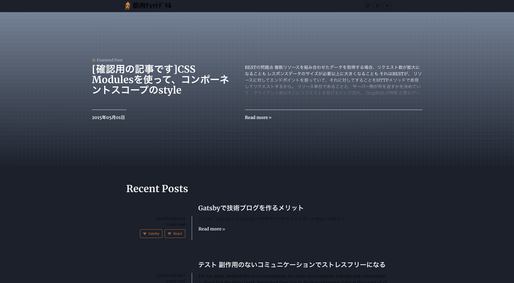
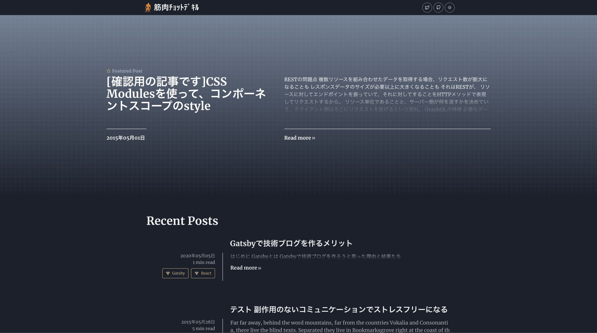

## 起きている問題

初期表示時に、一部ライトモードの色が使われている。


一度レンダリングすると、正しく表示される。


おそらく始めに`gatsby-build`したときは、  
lightテーマで静的ファイルを生成。

そのあとブラウザでは、ブラウザのLocalStorageで設定されているテーマで表示される。  
ダークモードで設定されていれば、ダークテーマで表示される。  
ただ、一部ChakraUIのコンポーネントは、buildされた状態のまま表示される。  
レンダリングすると、テーマがダークに変わっているので、再レンダリングが行われて正しく表示される。

build時にlightテーマで生成するのは問題ない。  
初期表示時にLocalStorageでダークモードが設定されていれば、レンダリング処理を行いたい。  
（それともそれって、SSGのメリットを失っている？）


ChakraUIの`ThemeProvider`は、Emotionの`ThemeProvider`を使っている。  
https://github.com/chakra-ui/chakra-ui/blob/master/packages/chakra-ui/src/ThemeProvider/index.js

```js:title=/packages/chakra-ui/src/ThemeProvider/index.js
/** @jsx jsx */
import { jsx, ThemeContext } from "@emotion/core";
import { ThemeProvider as EmotionThemeProvider } from "emotion-theming";
import { useContext } from "react";
import theme from "../theme";

const ThemeProvider = ({ theme, children }) => (
  <EmotionThemeProvider theme={theme}>{children}</EmotionThemeProvider>
);

ThemeProvider.defaultProps = {
  theme,
};

const useTheme = () => {
  const theme = useContext(ThemeContext);
  if (theme === undefined) {
    throw new Error("useTheme must be used within a ThemeProvider");
  }
  return theme;
};

export default ThemeProvider;
export { useTheme };
```


こっちがEmotionの`ThemeProvider`  
https://github.com/emotion-js/emotion/blob/6cb8d15438b01b8623af42f304d5ea3032332187/packages/emotion-theming/src/theme-provider.js

```js:title=/packages/emotion-theming/src/theme-provider.js
// @flow
import * as React from 'react'
import { ThemeContext } from '@emotion/core'
import weakMemoize from '@emotion/weak-memoize'

let getTheme = (outerTheme: Object, theme: Object | (Object => Object)) => {
  if (typeof theme === 'function') {
    const mergedTheme = theme(outerTheme)
    if (
      process.env.NODE_ENV !== 'production' &&
      (mergedTheme == null ||
        typeof mergedTheme !== 'object' ||
        Array.isArray(mergedTheme))
    ) {
      throw new Error(
        '[ThemeProvider] Please return an object from your theme function, i.e. theme={() => ({})}!'
      )
    }
    return mergedTheme
  }
  if (
    process.env.NODE_ENV !== 'production' &&
    (theme == null || typeof theme !== 'object' || Array.isArray(theme))
  ) {
    throw new Error(
      '[ThemeProvider] Please make your theme prop a plain object'
    )
  }

  return { ...outerTheme, ...theme }
}

let createCacheWithTheme = weakMemoize(outerTheme => {
  return weakMemoize(theme => {
    return getTheme(outerTheme, theme)
  })
})

type Props = {
  theme: Object | (Object => Object),
  children: React.Node
}

let ThemeProvider = (props: Props) => {
  return (
    <ThemeContext.Consumer>
      {theme => {
        if (props.theme !== theme) {
          theme = createCacheWithTheme(theme)(props.theme)
        }
        return (
          <ThemeContext.Provider value={theme}>
            {props.children}
          </ThemeContext.Provider>
        )
      }}
    </ThemeContext.Consumer>
  )
}

export default ThemeProvider
```

いくつか、ChakraUIを使っているGatsbyサイトを見てみた。  
そのなかでダークモードに変えることができ、表示がおかしくないサイトがあった。

https://github.com/KenzoBenzo/personal-portfolio

https://github.com/MattMattC/MattMattC.github.io

ただし、始めにブラウザがダークモードでもライトモードで表示するようだ。

みてみると、`gatsby-config.js`で、`gatsby-plugin-chakra-ui`を使っていない！？

実際にこのプラグインを削除してみたけど、何も変わらなかった。

何も変わらない？？このプラグインはなんだったの？

似たバグが有るサイト。

https://otttooming.github.io/projects/  
https://github.com/otttooming/otttooming.github.io

完全に正しいサイトはまだ見つかってない。  
でも、始めは必ずライトモードで表示されるサイトがある。  
どうやってる？コードを読む。

chakra-uiのversionかな？

versionだ！  
始めはライトモードになるサイトをクローンして、同じchakra-uiのversion（`"@chakra-ui/core@^0.7.0"`）で試してみたら、始めはダークモードになった！

ちがう。。
同じバージョンにしなくても、始めはダークモードだ。

これでいけた！
https://github.com/Calvein/acnh-surf-n-turf/commit/fee185eb535f76a14db15d8c299ae21727663d2c

このissueを見て、  
https://github.com/chakra-ui/chakra-ui/issues/511  
レポジトリ見に行ったら、提案されたものと違う実装に変えてた。

提案されてる方でもいけたけど、こちらでthemeごとのcolor指定せずにChakraのコンポーネント側でthemeごとにcolorを変更するコンポーネントで問題起きる。  
たとえば、TagのvariantColor  
https://chakra-ui.com/tag

やし、bugがfixされたときに変更箇所が少ないほうがいい。  
だから、`toggleColorMode();`を2回実行する方法で行く。

あーけど、リロードのたびに画面チラつくし、たまにリロードでテーマが変わったりするなぁ。。。
