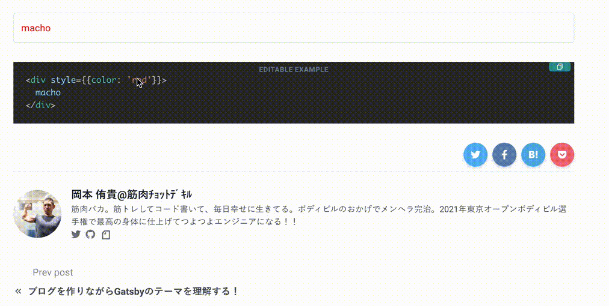

import Callout from '../../../src/components/widgetComponents/Callout';
import CodeBlock from '../../../src/components/MDXComponents/CodeBlock';
import Collapse from '../../../src/components/widgetComponents/Collapse';
import ExternalLink from '../../../src/components/widgetComponents/ExternalLink';

当ブログのコードブロックで実装している機能、そのコードを紹介します！

## 機能紹介

### シンタックスハイライト

`.mdx`ファイルにこんな感じに書くと、

<CodeBlock>
  {`
\`\`\`js  
const trainingMenu = new Set('Squat');  
\`\`\`
`}
</CodeBlock>

こうやって表示されます！

```js
const trainingMenu = new Set('Squat');
```

<Callout emoji='🙌' bg='orange.50'>
  言語を指定すると言語に合わせた色が付いて表示されます！
</Callout>

### タイトル

`.mdx`ファイルにこんな感じに書くと、

<CodeBlock>
  {`
\`\`\`js title=trainingMenu.js  
const trainingMenu = new Set('Squat');  
trainingMenu.add('Bulgarian squat');  
\`\`\`
`}
</CodeBlock>

こうやって表示されます！

```js title=trainingMenu.js
const trainingMenu = new Set('Squat');
trainingMenu.add('Bulgarian squat');
```

<Callout emoji='🙌' bg='orange.50'>
  タイトルが表示されました！
</Callout>

### コードのコピー

右上のコピーアイコンをクリックしてみてください！

```js title=trainingMenu.js
const trainingMenu = new Set('Squat');
trainingMenu.add('Bulgarian squat');
trainingMenu.add('Calf raises');
```

<Callout emoji='🙌' bg='orange.50'>
  コードがクリップボードにコピーされます！(^∀^)ᕗ
</Callout>

### 行のハイライト

`.mdx`ファイルにこんな感じに書くと、

<CodeBlock>
  {`
\`\`\`js title=trainingMenu.js line={1,3-4}  
const trainingMenu = new Set('Squat');  
trainingMenu.add('Bulgarian squat');  
trainingMenu.add('Calf raises');  
trainingMenu.add('Bench press');  
\`\`\`
`}
</CodeBlock>

こうやって表示されます！

```js title=trainingMenu.js line={1,3-4}
const trainingMenu = new Set('Squat');
trainingMenu.add('Bulgarian squat');
trainingMenu.add('Calf raises');
trainingMenu.add('Bench press');
```

<Callout emoji='🙌' bg='orange.50'>
  行を指定してハイライトができました！
</Callout>

### ワードのハイライト

コードブロック内のワードにカーソルを合わせてみてください！

```js title=trainingMenu.js line={1,3-4}
const trainingMenu = new Set('Squat');
trainingMenu.add('Bulgarian squat');
trainingMenu.add('Calf raises');
trainingMenu.add('Bench press');
trainingMenu.add('Chinning');
```

<Callout emoji='🙌' bg='orange.50'>
  同じワードがハイライトされます！Qiitaみたい！！
</Callout>


### JSX のデモ表示

`.mdx`ファイルにこんな感じに書くと、

<CodeBlock>
{`
\`\`\`jsx demo title=法が人を守るんじゃない、人が法を守るんです  
<Stack spacing='3'>  
  <Alert status='success'>
    <AlertIcon />
    犯罪係数アンダー60。<br/>執行対象ではありません。<br/>トリガーをロックします。
  </Alert>

  <Alert status='info'>
    <AlertIcon />
    犯罪係数オーバー130。<br/>執行モード：ノンリーサル・パラライザー。<br/>慎重に照準を定め 対象を制圧して下さい。  
  </Alert>  
  
  <Alert status='warning'>  
    <AlertIcon />  
    犯罪係数オーバー390。<br/>執行モード：リーサル・エリミネーター。<br/>慎重に照準を定め、対象を排除してください。  
  </Alert>  
  
  <Alert status='error'>  
    <AlertIcon />  
    対象の驚異判定が更新されました。<br/>執行モード：デストロイ・デコンポーザー。<br/>対象を完全排除します。ご注意下さい。  
  </Alert>  
</Stack>  
\`\`\`
`}
</CodeBlock>

こうやって表示されます！

```jsx demo title=法が人を守るんじゃない、人が法を守るんです
<Stack spacing='3'>
  <Alert status='success'>
    <AlertIcon />
    犯罪係数アンダー60。
    <br />
    執行対象ではありません。
    <br />
    トリガーをロックします。
  </Alert>

  <Alert status='info'>
    <AlertIcon />
    犯罪係数オーバー130。
    <br />
    執行モード：ノンリーサル・パラライザー。
    <br />
    慎重に照準を定め 対象を制圧して下さい。
  </Alert>

  <Alert status='warning'>
    <AlertIcon />
    犯罪係数オーバー390。
    <br />
    執行モード：リーサル・エリミネーター。
    <br />
    慎重に照準を定め、対象を排除してください。
  </Alert>

  <Alert status='error'>
    <AlertIcon />
    対象の驚異判定が更新されました。
    <br />
    執行モード：デストロイ・デコンポーザー。
    <br />
    対象を完全排除します。ご注意下さい。
  </Alert>
</Stack>
```

<Callout emoji='🙌' bg='orange.50'>
  demoとつけることで、コードブロックの上に書いたjsxのデモ表示ができます！
</Callout>

### JSX のライブエディター

`.mdx`ファイルにこんな感じに書くと、

<CodeBlock>
  {`
\`\`\`jsx live  
<div style={{color: 'red'}}>  
  macho  
</div>  
\`\`\`
`}
</CodeBlock>

こうやって表示されます！

```jsx live
<div style={{ color: 'red' }}>macho</div>
```

<Callout emoji='🙌' bg='orange.50'>
  liveを指定すると下のようにコードを編集してリアルタイムで表示されます！やってみてください！！
</Callout>



また、`isManual`を指定するとコンポーネントを定義して自身で render するライブエディターが書けます！

```jsx live isManual
function Counter() {
  const [count, setCount] = useState(0);

  return (
    <div>
      <p>You clicked {count} times</p>
      <button
        onClick={() => setCount(count + 1)}
        style={{
          border: '1px solid black',
          padding: '1px 6px',
        }}
      >
        Click me
      </button>
    </div>
  );
}

render(Counter, document.getElementById('root'));
```

## コード

上で紹介したコードブロックのコードです！  
ご参考に！！

```text title=コードブロック関連のファイルのパス
src/components/MDXComponents/CodeBlock
  ├── CopyButton.js
  ├── EditableHighlight.js
  ├── Highlight.js
  ├── Title.js
  ├── index.js
  └── react-live.js
```

<Collapse>
<>index.js</>

```jsx
import React, { useState } from 'react';

import EditableHighlight from './EditableHighlight';
import Highlight from './Highlight';
import { LiveError, LivePreview, LiveProvider } from './react-live';

const CodeBlock = ({
  className,
  live,
  isManual,
  demo,
  title,
  line,
  children,
  ...props
}) => {
  const [code, setCode] = useState(children.trim());

  const language = className && className.replace('language-', '');

  if (language === 'jsx' && live) {
    return (
      <LiveProvider
        language={language}
        code={code}
        isManual={isManual}
        {...props}
      >
        <LivePreview />
        <EditableHighlight code={code} setCode={setCode} title={title} />
        <LiveError />
      </LiveProvider>
    );
  }

  if (demo) {
    return (
      <LiveProvider
        language={language}
        code={code}
        isManual={isManual}
        {...props}
      >
        <LivePreview />
        <Highlight title={title} code={code} language={language} line={line} />
      </LiveProvider>
    );
  }

  return (
    <Highlight title={title} code={code} language={language} line={line} />
  );
};

export default CodeBlock;
```

</Collapse>

<Collapse>
<>Highlight.js</>

```jsx
import React, { useState } from 'react';
import PrismHighlight, { defaultProps } from 'prism-react-renderer';
import { useTheme, Box } from '@chakra-ui/core';
import theme from 'prism-react-renderer/themes/vsDark';
import rangeParser from 'parse-numeric-range';

import { generateAlphaColors } from '../../../theme/colors-utils';

import CopyButton from './CopyButton';
import Title from './Title';

const highlightStyle = {
  backgroundColor: '#2D2D2D',
  fontFamily: 'Consolas,Monaco,Andale Mono,Ubuntu Mono,monospace',
  fontSize: [12, 14],
  overflow: 'auto',
  py: 5,
  float: 'left',
  minWidth: 'full',
};

const calculateLinesToHighlight = meta => {
  const RE = /{([\d,-]+)}/;
  if (RE.test(meta)) {
    const strLineNumbers = RE.exec(meta)[1];
    const lineNumbers = rangeParser(strLineNumbers);
    return index => lineNumbers.includes(index + 1);
  } else {
    return () => false;
  }
};

const Line = ({ shouldHighlight, children, ...props }) => {
  const highlightProps = shouldHighlight && {
    d: 'block',
    bg: 'gray.700',
    borderLeftWidth: '.5rem',
    borderLeftColor: 'purple.200',
    px: '3',
  };
  return (
    <Box d='table-cell' px='5' {...props} {...highlightProps}>
      {children}
    </Box>
  );
};

const Word = ({ focusedWord, setFocusedWord, content, tokenProps }) => {
  const [delayHandler, setDelayHandler] = useState(null);
  const { colors } = useTheme();

  const orangeAlpha = generateAlphaColors(colors.orange[100]);

  const handleMouseEnter = word => {
    setDelayHandler(
      setTimeout(() => {
        setFocusedWord(word);
      }, 500)
    );
  };

  const handleMouseLeave = () => {
    setFocusedWord('');
    clearTimeout(delayHandler);
  };

  const shouldHighlighted = word => focusedWord === word && word.length > 1;

  return (
    <Box
      as='span'
      bg={shouldHighlighted(content) && orangeAlpha[400]}
      onMouseEnter={() => handleMouseEnter(content)}
      onMouseLeave={handleMouseLeave}
      {...tokenProps}
    />
  );
};

const Highlight = ({ title, code, language, line }) => {
  const [focusedWord, setFocusedWord] = useState('');

  const shouldHighlightLine = calculateLinesToHighlight(line);

  return (
    <Box my='8' rounded='md'>
      {title && <Title>{title}</Title>}
      <Box position='relative'>
        <PrismHighlight
          {...defaultProps}
          theme={theme}
          code={code}
          language={language}
        >
          {({ className, style, tokens, getLineProps, getTokenProps }) => (
            <Box overflowX='auto'>
              <Box
                as='pre'
                className={className}
                {...highlightStyle}
                style={{ ...style }}
              >
                {tokens.map((line, i) => (
                  <div key={i} {...getLineProps({ line, key: i })}>
                    <Line shouldHighlight={shouldHighlightLine(i)}>
                      {line.map((token, key) => (
                        <Word
                          key={key}
                          focusedWord={focusedWord}
                          setFocusedWord={setFocusedWord}
                          content={token.content.trim()}
                          tokenProps={getTokenProps({ token, key })}
                        />
                      ))}
                    </Line>
                  </div>
                ))}
              </Box>
            </Box>
          )}
        </PrismHighlight>
        <CopyButton code={code} />
      </Box>
    </Box>
  );
};

export default Highlight;
```

</Collapse>

<Collapse>
<>EditableHighlight.js</>

```jsx
import React from 'react';
import { LiveEditor } from 'react-live';
import { Box } from '@chakra-ui/core';

import CopyButton from './CopyButton';
import Title from './Title';

const liveEditorStyle = {
  fontSize: 14,
  fontFamily: 'Consolas,Monaco,Andale Mono,Ubuntu Mono,monospace',
  overflow: 'auto',
  backgroundColor: '#2D2D2D',
  whiteSpace: 'nowrap',
};

const EditableNotice = props => (
  <Box
    position='absolute'
    width='full'
    top='.25em'
    letterSpacing='wide'
    color='gray.500'
    fontSize='xs'
    fontWeight='bold'
    textAlign='center'
    textTransform='uppercase'
    {...props}
  >
    Editable Example
  </Box>
);

const EditableHighlight = ({ code, setCode, title }) => {
  const handleCodeChange = newCode => setCode(newCode.trim());

  return (
    <Box my='8' rounded='md'>
      {title && <Title>{title}</Title>}
      <Box position='relative'>
        <LiveEditor
          onChange={handleCodeChange}
          padding={20}
          style={liveEditorStyle}
        />
        <CopyButton code={code} />
        <EditableNotice />
      </Box>
    </Box>
  );
};

export default EditableHighlight;
```

</Collapse>

<Collapse>
<>react-live.js</>

```jsx
import React, { useState } from 'react';
import { mdx } from '@mdx-js/react';
import {
  LiveProvider as ReactLiveProvider,
  LiveError as ReactLiveError,
  LivePreview as ReactLivePreview,
} from 'react-live';
import * as Chakra from '@chakra-ui/core';
import theme from 'prism-react-renderer/themes/vsDark';

import * as widgetComponents from '../../widgetComponents';

const { Box } = Chakra;

const LiveError = props => (
  <Box
    as={ReactLiveError}
    fontFamily='Consolas,Monaco,Andale Mono,Ubuntu Mono,monospace'
    overFlowX='auto'
    color='white'
    bg='red.500'
    {...props}
  />
);

const LivePreview = props => (
  <Box
    as={ReactLivePreview}
    fontFamily='body'
    mt='5'
    p='3'
    border='1px'
    borderColor='inherit'
    rounded='md'
    {...props}
  />
);

const LiveProvider = ({ language, code, isManual, ...props }) => (
  <ReactLiveProvider
    theme={theme}
    language={language}
    code={code}
    transformCode={code => `/** @jsx mdx */ ${code}`}
    scope={{
      ...Chakra,
      ...widgetComponents,
      mdx,
      useState,
    }}
    noInline={isManual}
    {...props}
  />
);

export { LiveError, LivePreview, LiveProvider };
```

</Collapse>

<Collapse>
<>Title.js</>

```jsx
import React from 'react';
import { Box } from '@chakra-ui/core';

const Title = ({ children, ...props }) => (
  <Box
    fontFamily='Consolas,Monaco,Andale Mono,Ubuntu Mono,monospace'
    fontSize='sm'
    py='1'
    px='4'
    color='white'
    bg='#444444'
    overflowX='auto'
    {...props}
  >
    {children}
  </Box>
);

export default Title;
```

</Collapse>

<Collapse>
<>CopyButton.js</>

```jsx
import React from 'react';
import { useClipboard, Button as ChakraButton, Icon } from '@chakra-ui/core';
import { RiFileCopyLine } from 'react-icons/ri';

const Button = ({ hasCopied, ...props }) => (
  <ChakraButton
    size='sm'
    position='absolute'
    textTransform='uppercase'
    variantColor='teal'
    fontSize='xs'
    height='4'
    top='0'
    zIndex='1'
    right='.5em'
    {...props}
  >
    {hasCopied ? 'copied(^∀^)ᕗ' : <Icon as={RiFileCopyLine} />}
  </ChakraButton>
);

const CopyButton = ({ code, ...props }) => {
  const { onCopy, hasCopied } = useClipboard(code);
  return <Button onClick={onCopy} hasCopied={hasCopied} {...props} />;
};

export default CopyButton;
```

</Collapse>

<ExternalLink href='https://github.com/YuukiOkamoto/my-blog/tree/master/src/components/MDXComponents/CodeBlock'>
  GitHub
</ExternalLink>
