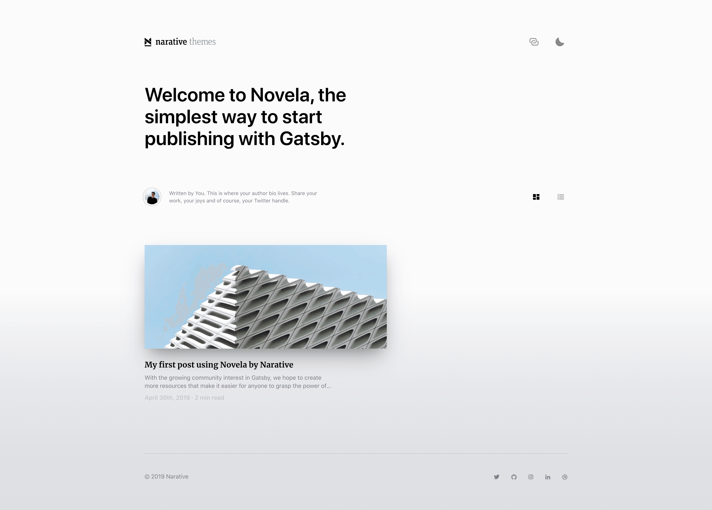
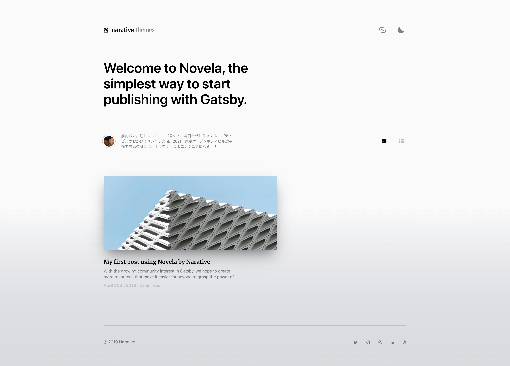
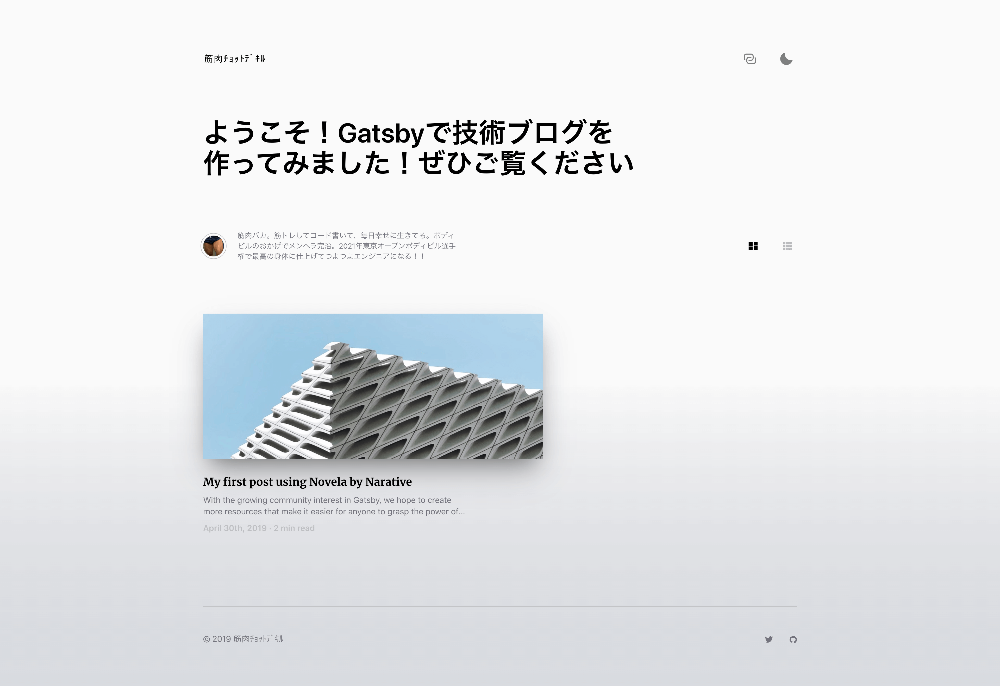

import Callout from '../../../src/components/widgetComponents/Callout';
import FigureImage from '../../../src/components/widgetComponents/FigureImage';
import ExternalLink from '../../../src/components/widgetComponents/ExternalLink';
import PostLink from '../../../src/components/widgetComponents/PostLink';

今回、Gatsby のテーマを使って JAMstack なブログを 30 分で作ってみようと思います。

## テーマを探す

テーマを探すには、以下のサイトがおすすめです！

- <ExternalLink href='https://www.gatsbyjs.org/plugins/?=gatsby-theme'>
    公式サイトのプラグインライブラリ
  </ExternalLink>
  で gatsby-theme と検索
- <ExternalLink href='https://jamstackthemes.dev/#ssg=gatsby'>
    JAMstack Themes
  </ExternalLink>
  でGatsbyを選択

今回は、`gatsby-theme-novela`という**テーマ**を使ってみようと思います。

- <ExternalLink href='https://github.com/narative/gatsby-theme-novela'>
    GitHub
  </ExternalLink>
- <ExternalLink href='https://www.narative.co/labs/novela/'>Demo</ExternalLink>
- <ExternalLink href='https://www.narative.co/design/open/novela'>
    Figma
  </ExternalLink>

## First Step

こちらでも書いたように、Gatsby の**テーマはプラグインの一種**です。

<PostLink to='/blog/what-is-gatsby-themes/' />

既にある Gatsby サイトにテーマを導入することも可能ですが、  
今回は 1 から Gatsby サイトを作っていきましょう。

`gatsby-theme-novela`を使った**スターター**が用意されているので、こちらを使いたいと思います。

<ExternalLink href='https://github.com/narative/gatsby-starter-novela'>
  https://github.com/narative/gatsby-starter-novela
</ExternalLink>

このスターターは、テーマを使い始める最低限の設定が既にされています。  
すぐにブログを始めることもできますし、ダウンロードしたスターターのコードを変更したりテーマのシャドウイングをして、サイトのカスタマイズをすることもできます。

<PostLink to='/blog/gatsby-theme-shadowing/' />

さあ！スターターを使います！

```shell title=gatsby-cliで始める
gatsby new blog-using-novela-theme https://github.com/narative/gatsby-starter-novela

cd blog-using-novela-theme

gatsby develop
```

または

```shell title=git cloneで始める
git clone git@github.com:narative/gatsby-starter-novela.git blog-using-novela-theme

cd blog-using-novela-theme

yarn

gatsby develop
```

これだけで、既にこのようなリッチなブログが完成です。

<ExternalLink href='https://5eca1281c5662600071d0da7--blog-using-novela-theme.netlify.app/'>
  Demo
</ExternalLink>



もちろん、今の状態からでも記事を書いてブログを始めることができます！

当記事ではこのあと以下の作業をしてみようかと思います！

- デプロイする
- Author を追加する
- サイトの設定を変える
- 記事を書く

## スターターの役割

作業を開始する前に、`gatsby-starter-novela`を使って始めたサイトの現状のコードを**かんたんに**把握しましょう。

現在のサイト内の構成は以下の通りです。

```text
  blog-using-novela-theme
    ├── content
    │ ├── authors
    │ │   ├── avatars
    │ │   │    ├── dennis-brotzky.jpg
    │ │   │    └── thiago-costa.png
    │ │   ├── dennis-brotzky.yml
    │ │   └── thiago-costa.yml
    │ └── posts
    │     └── 2020-01-01-my-first-novela-post
    │         ├── images
    │         │   ├── article-image-1.jpg
    │         │   └── article-image-2.jpg
    │         └── index.md
    ├── node_modules
    ├── src
    │ ├── assets
    │ │   └── favicon.png
    │ └── pages
    │     └── 404.js
    ├── static
    │ └── admin
    │     └── config.yml
    ├── gatsby-config.js
    └── package.json
```

<ExternalLink href='https://github.com/YuukiOkamoto/blog-using-novela-theme/tree/start'>
  GitHub
</ExternalLink>

まずは`gatsby-config.js`を見てみましょう！

このなかの`plugins`でテーマをオプション付きで使っています。

```js title=gatsby-config.js
plugins: [
  {
    resolve: "@narative/gatsby-theme-novela",
    options: {
      contentPosts: "content/posts",
      contentAuthors: "content/authors",
      basePath: "/",
      authorsPage: true,
      sources: {
        local: true,
        // contentful: true,
      },
    },
  },
  ...
```

`gatsby-config.js`ではテーマの他に、サイト名などのサイトの設定がされています。  
（あとで変えていきたいきます！）

```js title=gatsby-config.js collapse=gatsby-config.jsの全文を読む
module.exports = {
  siteMetadata: {
    title: `Novela by Narative`,
    name: `Narative`,
    siteUrl: `https://novela.narative.co`,
    description: `This is my description that will be used in the meta tags and important for search results`,
    hero: {
      heading: `Welcome to Novela, the simplest way to start publishing with Gatsby.`,
      maxWidth: 652,
    },
    social: [
      {
        name: `twitter`,
        url: `https://twitter.com/narative`,
      },
      {
        name: `github`,
        url: `https://github.com/narative`,
      },
      {
        name: `instagram`,
        url: `https://instagram.com/narative.co`,
      },
      {
        name: `linkedin`,
        url: `https://www.linkedin.com/company/narative/`,
      },
      {
        name: `dribbble`,
        url: `https://dribbble.com/narativestudio`,
      },
    ],
  },
  plugins: [
    {
      resolve: '@narative/gatsby-theme-novela',
      options: {
        contentPosts: 'content/posts',
        contentAuthors: 'content/authors',
        basePath: '/',
        authorsPage: true,
        sources: {
          local: true,
          // contentful: true,
        },
      },
    },
    {
      resolve: `gatsby-plugin-manifest`,
      options: {
        name: `Novela by Narative`,
        short_name: `Novela`,
        start_url: `/`,
        background_color: `#fff`,
        theme_color: `#fff`,
        display: `standalone`,
        icon: `src/assets/favicon.png`,
      },
    },
    {
      resolve: `gatsby-plugin-netlify-cms`,
      options: {},
    },
  ],
};
```

`gatsby-config.js`の他には、`content/`以下に author の設定や記事のファイルがあることがわかると思います。

## デプロイする

今回は<ExternalLink href='https://www.netlify.com/'>Netlify</ExternalLink>にデプロイしてみようと思います。

方法は netlify-cli を使うかブラウザで操作するかがあります。  
どちらも簡単にすぐにデプロイ出来るのでやってみましょう！

ブラウザで操作する簡単な手順は以下の通りです。

1. 先程作ったサイトを自身の GitHub などの git プロバイダーのレポジトリに push する
2. <ExternalLink href='https://www.netlify.com/'>Netlify</ExternalLink>
   にアクセスし、ログインする
3. `New site from Git`ボタンをクリック
4. 先程 push した git プロバイダーに接続して、Netlify の使用を許可する
5. 先程 push したレポジトリを選択し、`Deploy site`ボタンをクリック

以上で完了です。

あとは、push するたびに自動でデプロイが行われます！！

## Author を追加する

### どこを変更するか？調査する

もう一度現在のサイト構成をご確認ください。

```text line={3-8}
  blog-using-novela-theme
    ├── content
    │ ├── authors
    │ │   ├── avatars
    │ │   │    ├── dennis-brotzky.jpg
    │ │   │    └── thiago-costa.png
    │ │   ├── dennis-brotzky.yml
    │ │   └── thiago-costa.yml
    │ └── posts
    │     └── 2020-01-01-my-first-novela-post
    │         ├── images
    │         │   ├── article-image-1.jpg
    │         │   └── article-image-2.jpg
    │         └── index.md
    ├── node_modules
    ├── src
    │ ├── assets
    │ │   └── favicon.png
    │ └── pages
    │     └── 404.js
    ├── static
    │ └── admin
    │     └── config.yml
    ├── gatsby-config.js
    └── package.json
```

Author の情報は、`your-site/content/authors/`以下にあるようですね。

順にコードを確認して理解し、自分の情報を設定していきます。

おっと、その前に、いまある記事に目を通したいと思います。

このように metadata が設定されています。

```md line={3} title=content/posts/2020-01-01-my-first-post-using-novela-by-narative/index.md
---
title: My first post using Novela by Narative
author: Dennis Brotzky
date: 2019-04-30
hero: ./images/hero.jpg
excerpt: With the growing community interest in Gatsby, we hope to create more resources that make it easier for anyone to grasp the power of this incredible tool.
---
```

<Callout emoji='👀' bg='yellow.100'>
  authorに「Dennis Brotzky」が指定されてますね
</Callout>

続いて、author の設定ファイルを見てみましょう！

```yml line={1} title=content/authors/authors/dennis-brotzky.yml
name: Dennis Brotzky
bio: |
  Written by You. This is where your author bio lives. Share your work, your
  joys and of course, your Twitter handle.
avatar: ./avatars/dennis-brotzky.jpg
social:
  - url: https://unsplash.com
  - url: https://stackoverflow.com
  - url: https://github.com
  - url: https://github.com
  - url: https://github.com
featured: true
```

<Callout emoji='💡'>
  記事で指定したauthorと設定ファイルのnameが一致するauthorを使っているようです！
</Callout>

この設定は現在、サイト内の以下の場所で使用されています。

<FigureImage src='create-blog-with-theme/post-bio.png' alt='post bio'>
  記事タイトル下
  <ExternalLink
    pl='2'
    href='https://5eca1281c5662600071d0da7--blog-using-novela-theme.netlify.app/My-first-post-using-Novela-by-Narative'
  >
    Demo
  </ExternalLink>
  <ExternalLink
    pl='2'
    href='https://github.com/narative/gatsby-theme-novela/blob/b7effff73a/%40narative/gatsby-theme-novela/src/sections/article/Article.Hero.tsx#L27-L32'
  >
    該当コード
  </ExternalLink>
</FigureImage>

<FigureImage src='create-blog-with-theme/bio.png' alt='bio' mt='8'>
  authorページ
  <ExternalLink
    pl='2'
    href='https://5eca1281c5662600071d0da7--blog-using-novela-theme.netlify.app/authors/Dennis-Brotzky'
  >
    Demo
  </ExternalLink>
  <ExternalLink
    pl='2'
    href='https://github.com/narative/gatsby-theme-novela/blob/b7effff73a/%40narative/gatsby-theme-novela/src/sections/author/Author.Hero.tsx#L17-L26'
  >
    該当コード
  </ExternalLink>
</FigureImage>

### 自分自身を author に追加し、既存 author を削除する

新たに自分自身の author 設定ファイルを作成し、  
avatar 画像を追加し、  
既存記事の author を自分自身に変えます。

そして、既存の author は不要なので削除します。

```diff title=変更後の構成
  blog-using-novela-theme
    ├── content
    │ ├── authors
    │ │   ├── avatars
-   │ │   │    ├── dennis-brotzky.jpg
-   │ │   │    └── thiago-costa.png
+   │ │   │    └── yuuki-okamoto.jpeg
-   │ │   ├── dennis-brotzky.yml
-   │ │   ├── thiago-costa.yml
+   │ │   └── yuuki-okamoto.yml
    │ │
```

以下の設定ファイルを追加し、avatar 画像の`yuuki-okamoto.jpeg`を追加します。

```yml title=content/authors/authors/yuuki-okamoto.yml
name: 岡本 侑貴@筋肉ﾁｮｯﾄﾃﾞｷﾙ
bio: |
  筋肉バカ。筋トレしてコード書いて、毎日幸せに生きてる。ボディビルのおかげでメンヘラ完治。2021年東京オープンボディビル選手権で最高の身体に仕上げてつよつよエンジニアになる！！
avatar: ./avatars/yuuki-okamoto.jpeg
social:
  - url: https://github.com/YuukiOkamoto
  - url: https://twitter.com/it_fitness_jp
featured: true
```

次に記事の author を変更します。

```diff title=content/posts/2020-01-01-my-first-post-using-novela-by-narative/index.md
---
  title: My first post using Novela by Narative
- author: Dennis Brotzky
+ author: 岡本 侑貴@筋肉ﾁｮｯﾄﾃﾞｷﾙ
  date: 2019-04-30
  hero: ./images/hero.jpg
  excerpt: With the growing community interest in Gatsby, we hope to create more resources that make it easier for anyone to grasp the power of this incredible tool.
---
```

これで記事の author が自分に変更され、自分の author ページも出来上がりました。

<FigureImage
  src='create-blog-with-theme/post-bio-after.png'
  alt='post bio after'
>
  記事タイトル下
  <ExternalLink
    pl='2'
    href='https://5eca82d98f52a1000699e129--blog-using-novela-theme.netlify.app/My-first-post-using-Novela-by-Narative'
  >
    Demo
  </ExternalLink>
</FigureImage>

<FigureImage
  src='create-blog-with-theme/bio-after.png'
  alt='bio after'
  mt='8'
>
  authorページ
  <ExternalLink
    pl='2'
    href='https://5eca1281c5662600071d0da7--blog-using-novela-theme.netlify.app/authors/Dennis-Brotzky'
  >
    Demo
  </ExternalLink>
</FigureImage>

👍 <ExternalLink href='https://5eca869fa51adc000774832a--blog-using-novela-theme.netlify.app/'>現時点の Demo</ExternalLink>

👍 <ExternalLink href='https://github.com/YuukiOkamoto/blog-using-novela-theme/tree/add-author'>現時点のソースコード(GitHub)</ExternalLink>

## サイトの設定を変える

現在、サイトの状態はスターターの初期設定のままのものが多いです。  
例えば、

- ヘッダー左上のサイトロゴ
- トップページの説明
- meta タグ
- コピーライト
- フッターの SNS リンク
- PWA の設定



これらを自分のサイト用に変えてきましょう。

表示されているコンポーネントのコードを読み、  
変更する箇所を特定し、  
変更を加えたいと思います。

<ExternalLink href='https://github.com/narative/gatsby-theme-novela/tree/b7effff73a31d72f91954089a886f7fbd6729413/%40narative/gatsby-theme-novela'>
  テーマのソースコード
</ExternalLink>
から探していきます。

### ヘッダー左上のサイトロゴ

コーデリーディングの過程は省略しますが、以下のコンポーネントが関係していそうです。

<ExternalLink href='https://github.com/narative/gatsby-theme-novela/blob/master/%40narative/gatsby-theme-novela/src/components/Navigation/Navigation.Header.tsx#L124'>
  gatsby-theme-novela/src/components/Navigation/Navigation.Header.tsx
</ExternalLink>
でLogoコンポーネントを表示している👀

```jsx line={22} title=@narative/gatsby-theme-novela/src/components/Navigation/Navigation.Header.tsx
import React, { useContext } from 'react';
import Logo from "@components/Logo";
...

const NavigationHeader: React.FC<{}> = () => {
  ...
  return (
    <Section>
      <NavContainer>
        <LogoLink
          to={rootPath || basePath}
          data-a11y="false"
          title="Navigate back to the homepage"
          aria-label="Navigate back to the homepage"
          back={showBackArrow ? "true" : "false"}
        >
          {showBackArrow && (
            <BackArrowIconContainer>
              <Icons.ChevronLeft fill={fill} />
            </BackArrowIconContainer>
          )}
          <Logo fill={fill} />
          <Hidden>Navigate back to the homepage</Hidden>
        </LogoLink>
        <NavControls>
          {showBackArrow ? (
            <button
              onClick={() => navigate(previousPath)}
              title="Navigate back to the homepage"
              aria-label="Navigate back to the homepage"
            >
              <Icons.Ex fill={fill} />
            </button>
          ) : (
            <>
              <SharePageButton />
              <DarkModeToggle />
            </>
          )}
        </NavControls>
      </NavContainer>
    </Section>
  );
};
```

<ExternalLink href='https://github.com/narative/gatsby-theme-novela/blob/master/%40narative/gatsby-theme-novela/src/components/Logo/Logo.tsx'>
  gatsby-theme-novela/src/components/Logo/Logo.tsx
</ExternalLink>
をカスタマイズすれば良さそう🤔

```jsx title=@narative/gatsby-theme-novela/src/components/Logo/Logo.tsx collapse=現在のLogoコンポーネント
import React from 'react';
import styled from '@emotion/styled';

import mediaqueries from '@styles/media';

import { Icon } from '@types';

const Logo: Icon = ({ fill = 'white' }) => {
  return (
    <LogoContainer>
      <svg
        width='192'
        height='23'
        viewBox='0 0 192 23'
        fill='none'
        xmlns='http://www.w3.org/2000/svg'
        className='Logo__Desktop'
      >
        <g clipPath='url(#clip0)'>
          <path
            d='M120.941 6.15477H122.453V2.83255L124.114 2.44922V6.15477H126.713V7.30477H124.114V16.377C124.114 17.314 124.54 17.7826 125.435 17.7826C125.925 17.7826 126.478 17.6335 126.904 17.4205L127.181 18.4214C126.606 18.7835 125.861 18.9964 124.86 18.9964C123.539 18.9964 122.432 18.3788 122.432 16.5261V7.30477H120.92V6.15477H120.941Z'
            fill='#7A8085'
          />
          <path
            d='M131.739 7.77334C132.825 6.70852 134.273 5.89926 135.764 5.89926C137.723 5.89926 138.937 6.94278 138.937 9.17889V17.6122L140.555 17.8465V18.7409H137.233V9.58352C137.233 7.9863 136.616 7.30482 135.338 7.30482C134.166 7.30482 132.74 8.0076 131.739 8.90204V17.5909L133.442 17.8039V18.7196H128.416V17.8039L130.078 17.5909V1.29926L128.374 1.04371V0.0214844H131.739V7.77334V7.77334Z'
            fill='#7A8085'
          />
          <path
            d='M141.854 12.4374C141.854 7.6883 143.92 5.89941 146.731 5.89941C149.648 5.89941 151.267 7.64571 151.267 11.9689V12.629H143.6C143.621 16.3772 144.686 17.8253 147.284 17.8253C148.605 17.8253 149.584 17.3994 150.5 16.7818L151.096 17.6124C150.01 18.5068 148.754 18.9966 147.008 18.9966C143.941 18.9753 141.854 17.2929 141.854 12.4374ZM143.621 11.5216H149.521C149.521 8.34849 148.754 6.98552 146.709 6.98552C144.857 6.98552 143.771 8.2633 143.621 11.5216Z'
            fill='#7A8085'
          />
          <path
            d='M162.682 7.85849C163.768 6.70849 165.024 5.87793 166.515 5.87793C168.474 5.87793 169.646 6.92145 169.646 9.15756V17.6335L171.286 17.8677V18.6983H167.963V9.68997C167.963 8.07145 167.388 7.32608 166.089 7.32608C164.918 7.32608 163.789 8.02886 162.81 8.9233V17.6122L164.449 17.8464V18.7409H161.127V9.68997C161.127 8.07145 160.552 7.32608 159.253 7.32608C158.082 7.32608 156.953 8.02886 155.973 8.9233V17.6122L157.677 17.8464V18.7409H152.651V17.8464L154.312 17.6122V7.47515L152.609 7.2196V6.15478H155.654L155.888 7.85849C156.974 6.72978 158.188 5.89923 159.679 5.89923C161.212 5.87793 162.277 6.51682 162.682 7.85849Z'
            fill='#7A8085'
          />
          <path
            d='M171.925 12.4374C171.925 7.6883 173.991 5.89941 176.802 5.89941C179.719 5.89941 181.338 7.64571 181.338 11.9689V12.629H173.671C173.692 16.3772 174.757 17.8253 177.355 17.8253C178.676 17.8253 179.655 17.3994 180.571 16.7818L181.167 17.6124C180.081 18.5068 178.825 18.9966 177.079 18.9966C174.012 18.9753 171.925 17.2929 171.925 12.4374ZM173.692 11.5216H179.591C179.591 8.34849 178.825 6.98552 176.78 6.98552C174.928 6.98552 173.863 8.2633 173.692 11.5216Z'
            fill='#7A8085'
          />
          <path
            d='M183.084 18.0383V15.504H184.234L184.618 17.442C185.278 17.7189 185.789 17.8892 186.811 17.8892C188.664 17.8892 189.558 17.0374 189.558 15.5466C189.558 14.0559 188.834 13.4809 186.79 12.8846C184.831 12.2883 183.382 11.4577 183.382 9.13645C183.382 7.39016 184.639 5.89941 187.195 5.89941C188.664 5.89941 189.835 6.17627 190.687 6.68738V9.15775H189.558L189.132 7.34756C188.579 7.09201 187.961 7.00682 187.258 7.00682C185.789 7.00682 184.852 7.7309 184.852 8.98738C184.852 10.3077 185.576 10.8189 187.365 11.3513C189.431 12.0115 191.156 12.7142 191.156 15.3976C191.156 17.7615 189.431 18.9753 186.79 18.9753C185.235 18.9753 183.957 18.6346 183.084 18.0383Z'
            fill='#7A8085'
          />
          <path
            d='M38.3122 9.98811C38.3122 8.66774 37.9501 8.15663 36.9492 8.15663C36.1186 8.15663 35.0964 8.62515 34.3936 9.20015V16.9733L35.8418 17.165V18.6344H30.0918V17.165L31.5825 16.9733V8.24182L30.0918 7.92237V6.19737H33.9251L34.2446 7.64552C35.3733 6.55941 36.6298 5.87793 38.1418 5.87793C39.9946 5.87793 41.102 6.92145 41.102 9.07237V16.9733L42.5927 17.165V18.6344H38.3122V9.98811V9.98811Z'
            fill={fill}
          />
          <path
            d='M62.3982 17.1858V18.6553H56.0732V17.1858L57.564 16.9942V8.2627L56.0732 7.94326V6.21826H59.8427L60.226 8.17752C61.0779 6.85715 62.1427 5.94141 63.6973 5.94141C63.8677 5.94141 64.0594 5.9627 64.1871 6.0053L63.8251 8.94418C63.5483 8.81641 63.2501 8.77381 62.8668 8.77381C61.8871 8.77381 61.1418 9.05067 60.3751 9.71085V16.9516L62.3982 17.1858Z'
            fill={fill}
          />
          <path
            d='M76.7098 6.19733H78.0941V3.08807L80.5432 2.55566V6.21863H82.9709V8.0927H80.5432V15.6742C80.5432 16.5899 80.8839 16.9946 81.6293 16.9946C82.0978 16.9946 82.5876 16.8455 82.907 16.6751L83.3543 18.3575C82.758 18.6983 81.9061 18.9751 80.6709 18.9751C78.9672 18.9751 78.0941 18.1658 78.0941 16.0362V8.0927H76.7098V6.19733Z'
            fill={fill}
          />
          <path
            d='M90.4664 17.1648V18.6343H84.6738V17.1648L86.1646 16.9731V8.24167L84.6738 7.92222V6.19722H88.9757V16.9731L90.4664 17.1648ZM85.696 1.76759C85.696 0.787963 86.4627 0 87.4423 0C88.422 0 89.1886 0.766667 89.1886 1.76759C89.1886 2.72593 88.422 3.51389 87.421 3.51389C86.4627 3.51389 85.696 2.72593 85.696 1.76759Z'
            fill={fill}
          />
          <path
            d='M98.3251 7.90097V6.19727H103.053V7.92227L101.924 8.11393L98.3251 18.6556H95.663L92.064 8.09264L90.9991 7.92227V6.19727H96.2593V7.90097L95.0242 8.09264L96.7279 13.6084C97.0473 14.6519 97.1964 15.5037 97.3668 16.4834H97.388C97.5371 15.525 97.7714 14.5241 98.0482 13.5871L99.6668 8.07134L98.3251 7.90097Z'
            fill={fill}
          />
          <path
            d='M75.6867 17.1224C74.5793 17.1437 74.3664 16.952 74.3664 15.9724V9.79645C74.3664 6.96404 72.9821 5.87793 70.3201 5.87793C68.3821 5.87793 66.7423 6.45293 65.4219 7.28349L66.2312 9.02978C67.3599 8.45478 68.4673 8.09274 69.7238 8.09274C71.1932 8.09274 71.5552 8.88071 71.5552 10.265V11.0316V11.2233V12.7779V12.8844V16.1214C71.0867 16.6326 70.4052 17.0585 69.4469 17.0585C68.3821 17.0585 67.871 16.5261 67.871 15.0353C67.871 13.3103 68.5951 12.8205 70.4904 12.7779V11.2233C66.6358 11.2659 65.0386 12.4372 65.0386 15.2057C65.0386 17.8465 66.4867 18.9752 68.6589 18.9752C70.2136 18.9752 71.0654 18.315 71.7895 17.5696C72.0451 18.5705 72.833 18.9752 73.8978 18.9752C74.6645 18.9752 75.3886 18.7622 75.8571 18.5066L75.6867 17.1224Z'
            fill={fill}
          />
          <path
            d='M54.4968 17.1224C53.3894 17.1437 53.1764 16.952 53.1764 15.9724V9.79645C53.1764 6.96404 51.7922 5.87793 49.1301 5.87793C47.1922 5.87793 45.5523 6.45293 44.232 7.28349L45.0412 9.02978C46.1699 8.45478 47.2773 8.09274 48.5338 8.09274C50.0033 8.09274 50.3653 8.88071 50.3653 10.265V11.0316V11.2233V12.7779V12.8844V16.1214C49.8968 16.6326 49.2153 17.0585 48.257 17.0585C47.1922 17.0585 46.681 16.5261 46.681 15.0353C46.681 13.3103 47.4051 12.8205 49.3005 12.7779V11.2233C45.4459 11.2659 43.8486 12.4372 43.8486 15.2057C43.8486 17.8465 45.2968 18.9752 47.469 18.9752C49.0236 18.9752 49.8755 18.315 50.5996 17.5696C50.8551 18.5705 51.6431 18.9752 52.7079 18.9752C53.4746 18.9752 54.1986 18.7622 54.6672 18.5066L54.4968 17.1224Z'
            fill={fill}
          />
          <path
            d='M107.653 13.055H113.594V11.9476C113.594 7.47534 111.869 5.89941 108.803 5.89941C105.63 5.89941 103.628 7.79478 103.628 12.4161C103.628 17.1013 105.523 18.9966 109.058 18.9966C110.954 18.9966 112.231 18.5068 113.467 17.5272L112.657 16.0577C111.678 16.6753 110.868 17.0587 109.463 17.0587C107.546 17.0587 106.801 16.1855 106.63 14.0133C106.588 13.6939 106.567 13.0976 106.567 12.4587C106.567 12.054 106.567 11.6707 106.588 11.3726V11.3513C106.737 8.51886 107.397 7.60312 108.781 7.60312C110.4 7.60312 110.783 8.58275 110.783 11.3513H107.674V13.055H107.653Z'
            fill={fill}
          />
          <path d='M17.5907 20.2954H0V23H17.5907V20.2954Z' fill={fill} />
          <path
            d='M0 7.96484V18.9537L5.38796 15.1843V11.7343L0 7.96484Z'
            fill={fill}
          />
          <path
            d='M17.5689 10.9463V0L12.1597 3.74815V7.13426L17.5689 10.9463Z'
            fill={fill}
          />
          <path
            d='M17.5907 18.975L17.5694 12.288L0 0V6.62315L17.5907 18.975Z'
            fill={fill}
          />
        </g>
        <defs>
          <clipPath id='clip0'>
            <rect width='191.156' height='23' fill='white' />
          </clipPath>
        </defs>
      </svg>

      <svg
        width='18'
        height='23'
        viewBox='0 0 18 23'
        fill='none'
        xmlns='http://www.w3.org/2000/svg'
        className='Logo__Mobile'
      >
        <path d='M17.5907 20.2954H0V23H17.5907V20.2954Z' fill={fill} />
        <path
          d='M0 7.96484V18.9537L5.38796 15.1843V11.7343L0 7.96484Z'
          fill={fill}
        />
        <path
          d='M17.5689 10.9463V0L12.1597 3.74815V7.13426L17.5689 10.9463Z'
          fill={fill}
        />
        <path
          d='M17.5907 18.975L17.5694 12.288L0 0V6.62315L17.5907 18.975Z'
          fill={fill}
        />
      </svg>
    </LogoContainer>
  );
};

export default Logo;

const LogoContainer = styled.div`
  .Logo__Mobile {
    display: none;
  }

  ${mediaqueries.tablet`
    .Logo__Desktop {
      display: none;
    }
    
    .Logo__Mobile{
      display: block;
    }
  `}
`;
```

テーマをシャドウイングしてカスタマイズします。  
シャドウイングしたいコンポーネントのパスが`@narative/gatsby-theme-novela/src/components/Logo/Logo.tsx`なので、  
`src/@narative/gatsby-theme-novela/components/Logo/Logo.js`というファイルを自サイトに作ります。

任意の svg を記述してください。  
svg の fill は props の fill を使いましょう。

```jsx title=src/@narative/gatsby-theme-novela/components/Logo/Logo.js collapse=例を見る
import React from 'react';

const Logo = ({ fill }) => (
  <svg
    version='1.0'
    xmlns='http://www.w3.org/2000/svg'
    width='192'
    height='23'
    viewBox='0 0 17000 2030'
    preserveAspectRatio='xMidYMid meet'
  >
    <g id='layer101' fill={fill} stroke='none'>
      <path d='M824 1683 l-41 -44 56 -26 c102 -49 195 -165 227 -287 8 -29 14 -101 14 -165 l0 -114 -115 5 -115 5 0 -42 0 -43 115 5 115 6 0 -127 0 -126 58 0 58 0 -4 125 -4 125 166 0 166 0 0 330 0 329 -34 35 c-37 36 -99 56 -179 56 l-42 0 -1 -40 c-1 -22 -9 -49 -18 -59 -9 -9 -16 -20 -16 -23 0 -2 36 -3 80 0 55 3 85 1 95 -8 13 -11 15 -54 15 -281 l0 -269 -115 0 -115 0 0 108 c0 128 -23 232 -72 325 -37 70 -152 191 -213 223 l-40 21 -41 -44z' />
      <path d='M2909 1728 c0 -1 -1 -22 -3 -44 -1 -23 -10 -53 -19 -68 l-17 -26 88 0 c55 0 92 -4 100 -12 9 -9 12 -125 12 -460 l0 -448 -248 0 c-137 0 -252 3 -256 7 -3 4 42 38 101 76 85 55 191 127 281 193 8 5 -10 41 -36 73 l-28 33 -186 -126 -185 -126 -38 58 c-70 105 -184 200 -298 247 -37 15 -37 15 -47 -11 -6 -15 -20 -40 -31 -56 -12 -16 -20 -30 -18 -32 2 -2 39 -20 82 -41 99 -48 202 -142 245 -223 18 -33 32 -63 32 -66 0 -3 -86 -6 -191 -6 l-190 0 3 520 3 520 -64 0 -64 0 7 -77 c3 -42 6 -296 6 -565 l0 -488 259 0 c221 0 260 -2 265 -15 3 -8 8 -62 12 -120 l7 -105 68 0 c59 0 69 3 69 18 -1 24 -19 162 -26 194 l-6 28 296 0 296 0 0 493 c0 325 -4 505 -11 531 -13 49 -54 89 -106 103 -39 12 -163 28 -164 21z' />
      <path d='M269 1667 l-37 -43 33 -21 c17 -12 40 -38 51 -60 17 -35 19 -67 22 -405 l3 -368 219 0 220 0 0 395 c0 320 -3 402 -14 430 -20 47 -79 75 -172 82 l-74 6 0 -32 c0 -18 -7 -45 -15 -61 l-16 -30 75 0 c111 0 106 6 106 -126 l0 -114 -108 0 -109 0 -6 99 c-7 122 -32 190 -89 248 -23 24 -45 43 -48 43 -3 -1 -21 -20 -41 -43z m401 -497 l0 -80 -110 0 -110 0 0 80 0 80 110 0 110 0 0 -80z m0 -240 l0 -90 -110 0 -110 0 0 90 0 90 110 0 110 0 0 -90z' />
      <path d='M5491 1665 c-22 -24 -41 -48 -41 -52 0 -5 23 -21 51 -38 78 -45 174 -155 219 -249 58 -120 87 -251 115 -509 l7 -59 51 7 c29 4 56 10 60 14 10 10 -18 259 -43 376 -42 200 -109 333 -222 441 -53 51 -137 114 -152 114 -2 0 -22 -20 -45 -45z' />
      <path d='M4880 1655 l0 -35 -185 0 -185 0 0 -60 0 -60 185 0 185 0 0 -150 0 -150 -175 0 -175 0 0 -55 0 -55 175 0 175 0 0 -125 0 -125 -180 0 -180 0 0 -55 0 -55 240 0 240 0 0 480 0 480 -60 0 -60 0 0 -35z' />
      <path d='M3630 1623 c0 -5 -18 -31 -40 -60 l-39 -52 34 -21 c48 -29 110 -103 140 -165 35 -71 54 -144 61 -242 l7 -83 -142 0 -141 0 0 -70 0 -70 140 0 140 0 0 -111 0 -111 -27 6 c-121 24 -155 28 -162 20 -4 -5 -15 -34 -23 -65 l-16 -56 105 -17 c129 -21 258 -58 339 -97 34 -16 65 -29 68 -29 3 0 17 23 32 52 25 50 26 52 8 66 -19 14 -122 64 -156 76 -16 5 -18 20 -18 136 l0 130 125 0 125 0 0 70 0 70 -125 0 -124 0 -5 33 c-3 17 -7 67 -10 110 -14 192 -87 336 -229 448 -47 38 -67 47 -67 32z' />
      <path d='M7244 1597 c-75 -81 -75 -68 3 -144 106 -103 124 -157 138 -405 l6 -108 -136 0 -136 0 3 -67 3 -68 330 0 330 0 3 68 3 67 -124 0 -124 0 -7 133 c-8 164 -27 264 -66 343 -30 61 -107 150 -166 191 l-31 22 -29 -32z' />
      <path d='M9842 1577 l-53 -53 25 -45 c31 -56 62 -170 76 -279 5 -46 10 -236 10 -422 l0 -338 76 0 76 0 -5 388 c-5 396 -10 452 -52 601 -18 60 -83 201 -94 201 -4 0 -30 -24 -59 -53z' />
      <path d='M10160 1580 l-41 -49 1 -363 c0 -200 3 -372 5 -383 2 -11 4 -100 4 -197 l1 -178 76 0 77 0 -5 458 -5 457 28 -60 c15 -33 44 -105 65 -160 20 -55 40 -104 45 -109 4 -5 31 14 61 42 l53 50 -34 84 c-59 146 -151 308 -239 416 -19 23 -38 42 -42 42 -5 0 -27 -22 -50 -50z' />
      <path d='M6400 995 l0 -625 70 0 70 0 0 209 0 208 68 23 c77 26 243 109 285 142 l28 23 -26 58 -27 58 -51 -31 c-58 -35 -153 -81 -228 -110 l-49 -20 0 345 0 345 -70 0 -70 0 0 -625z' />
      <path d='M9220 1593 c-1 -59 -28 -444 -31 -447 -2 -2 -60 3 -128 11 -68 8 -124 13 -126 11 -2 -2 -6 -33 -10 -69 l-7 -66 134 -14 c132 -14 133 -14 131 -39 -1 -14 -5 -72 -8 -130 l-7 -106 -106 11 c-77 8 -109 8 -114 1 -4 -6 -8 -36 -8 -67 l0 -56 88 -7 c147 -12 135 1 131 -140 l-4 -121 68 -3 67 -3 0 39 c0 21 3 74 7 116 l6 78 86 -8 c156 -14 145 -18 146 49 1 43 -3 61 -15 67 -8 4 -59 11 -114 15 l-98 8 7 131 c4 72 8 132 10 134 2 2 58 -3 126 -11 68 -8 125 -14 125 -13 1 0 5 31 8 67 l7 67 -43 6 c-24 3 -82 8 -130 12 -72 6 -88 10 -88 23 0 9 7 115 15 236 8 121 15 226 15 233 0 8 -21 12 -70 12 -70 0 -70 0 -70 -27z' />
      <path d='M2131 1497 c-14 -28 -26 -55 -28 -58 -2 -3 22 -16 54 -27 91 -34 180 -92 243 -159 63 -67 91 -126 111 -238 l13 -65 35 6 c20 3 50 9 68 13 l31 6 -24 75 c-13 41 -24 78 -24 82 0 4 42 35 93 69 50 34 129 89 175 121 l82 59 -32 46 c-18 24 -36 47 -40 49 -3 2 -47 -25 -97 -61 -50 -36 -125 -88 -167 -115 l-76 -50 -42 58 c-62 84 -150 158 -242 203 -44 21 -87 39 -95 39 -8 0 -25 -24 -38 -53z' />
      <path d='M5455 1198 c-13 -33 -104 -332 -102 -334 1 -1 25 -13 54 -28 l52 -26 36 118 c20 64 43 137 51 161 20 63 19 66 -30 95 -51 30 -55 31 -61 14z' />
      <path d='M5582 947 c-24 -83 -45 -162 -48 -173 -5 -17 3 -26 42 -48 26 -14 49 -24 51 -22 7 7 102 319 103 336 0 14 -73 60 -95 60 -5 0 -29 -69 -53 -153z' />
      <path d='M260 762 c-19 -9 -37 -17 -38 -18 -2 -2 19 -30 46 -63 74 -89 133 -175 192 -279 34 -61 57 -92 65 -88 8 3 32 10 54 16 l41 11 -30 59 -30 60 215 0 215 0 0 35 0 35 -159 2 -159 3 34 84 c19 47 34 86 34 87 0 3 -88 24 -102 24 -7 0 -30 -44 -52 -100 -42 -109 -59 -122 -92 -72 -36 57 -177 222 -188 221 -6 0 -27 -8 -46 -17z' />
      <path d='M907 708 l-38 -20 49 -52 c26 -28 62 -72 80 -98 33 -48 95 -171 104 -206 5 -17 10 -17 62 -8 31 6 56 14 56 18 0 4 -9 30 -19 58 l-19 50 219 0 219 0 0 35 0 35 -165 0 c-91 0 -165 3 -165 6 0 3 16 34 35 68 19 35 35 67 35 72 0 12 -89 46 -101 38 -9 -5 -89 -157 -89 -168 0 -3 8 -7 18 -9 9 -3 3 -5 -14 -6 -27 -1 -38 7 -75 57 -58 76 -129 152 -143 151 -6 0 -28 -10 -49 -21z' />
      <path d='M7197 584 c-4 -4 -7 -36 -7 -71 l0 -63 255 0 256 0 -3 68 -3 67 -246 3 c-135 1 -248 -1 -252 -4z' />
      <path d='M8078 457 l-57 -92 32 -27 32 -28 32 38 c18 20 46 62 62 92 l30 56 -34 27 c-19 15 -35 27 -37 27 -2 0 -29 -42 -60 -93z' />
      <path d='M8178 392 c-32 -49 -58 -92 -58 -98 0 -5 16 -19 35 -31 l34 -22 34 47 c19 26 46 68 61 93 l26 46 -34 27 c-19 14 -36 26 -38 26 -2 0 -29 -40 -60 -88z' />
    </g>
  </svg>
);

export default Logo;
```

<ExternalLink href='https://github.com/YuukiOkamoto/blog-using-novela-theme/blob/config-site/src/%40narative/gatsby-theme-novela/components/Logo/Logo.js'>
  GitHub
</ExternalLink>

### トップページの説明

テーマのソースコードを読んでみると、`ArticleHero`コンポーネントで表示しているようです。

```jsx line={11-13,42-44} title=@narative/gatsby-theme-novela/src/sections/articles/Articles.Hero.tsx
import React, { useContext } from 'react';
import { graphql, useStaticQuery } from 'gatsby';

...

const authorQuery = graphql`
  {
    site: allSite {
      edges {
        node {
          siteMetadata {
            hero {
              heading
              maxWidth
            }
          }
        }
      }
    }
  }
`;

const ArticlesHero: React.FC<IAuthor> = ({ authors }) => {
  const { gridLayout = 'tiles', hasSetGridLayout, setGridLayout } = useContext(
    GridLayoutContext,
  );

  const results = useStaticQuery(authorQuery);
  const hero = results.site.edges[0].node.siteMetadata.hero;
  const tilesIsActive = hasSetGridLayout && gridLayout === 'tiles';
  const featuredAuthor = authors.find(author => author.featured);

  if (!featuredAuthor) {
    throw new Error(`
      No featured Author found.
      Please ensure you have at least featured Author.
  `);
  }

  return (
    <Section relative id="Articles__Hero">
      <HeadingContainer style={{ maxWidth: `${hero.maxWidth}px` }}>
        <HeroHeading dangerouslySetInnerHTML={{ __html: hero.heading }} />
      </HeadingContainer>
      <SubheadingContainer>
        <Bio author={featuredAuthor} />
        <GridControlsContainer>
          <GridButton
            onClick={() => setGridLayout('tiles')}
            active={tilesIsActive}
            data-a11y="false"
            title="Show articles in Tile grid"
            aria-label="Show articles in Tile grid"
          >
            <Icons.Tiles />
          </GridButton>
          <GridButton
            onClick={() => setGridLayout('rows')}
            active={!tilesIsActive}
            data-a11y="false"
            title="Show articles in Row grid"
            aria-label="Show articles in Row grid"
          >
            <Icons.Rows />
          </GridButton>
        </GridControlsContainer>
      </SubheadingContainer>
    </Section>
  );
};

...
```

<ExternalLink href='https://github.com/narative/gatsby-theme-novela/blob/master/%40narative/gatsby-theme-novela/src/sections/articles/Articles.Hero.tsx#L49-L51'>
  GitHub
</ExternalLink>

また、siteMetadata の hero の heading 情報が使われていることもわかります。

これは、`gatsby-config.js`で設定されています。  
以下のように任意の文章に変えてみましょう！  
（ついでに`maxWidth`も変えてみた）

```diff title=gatsby-config.js line={8}
 module.exports = {
   siteMetadata: {
     title: `Novela by Narative`,
     name: `Narative`,
     siteUrl: `https://novela.narative.co`,
     description: `This is my description that will be used in the meta tags and important for search results`,
     hero: {
-      heading: `Welcome to Novela, the simplest way to start publishing with Gatsby.`,
+      heading: `ようこそ！Gatsbyで技術ブログを作ってみました！ぜひご覧ください`,
-      maxWidth: 652,
+      maxWidth: 829,
     },
     ...
   },
   ...
 };
```

### meta タグ

meta タグの設定はテーマ内の SEO コンポーネントに記述があります。

```jsx collapse=SEOコンポーネント（長いです） title=@narative/gatsby-theme-novela/src/components/SEO/SEO.tsx
/**
 * This react helmt code is adapted from
 * https://themeteorchef.com/tutorials/reusable-seo-with-react-helmet.
 *
 * A great tutorial explaining how to setup a robust version of an
 * SEO friendly react-helmet instance.
 *
 *
 * Use the Helmt on pages to generate SEO and meta content!
 *
 * Usage:
 * <SEO
 *   title={title}
 *   description={description}
 *   image={image}
 * />
 *
 */

import React from 'react';
import Helmet from 'react-helmet';
import { graphql, useStaticQuery } from 'gatsby';

interface HelmetProps {
  articlepathName?: string;
  authorName?: string;
  authorsBio?: string;
  authorsSlug?: string;
  canonicalUrl?: string;
  dateforSEO?: string;
  description?: string;
  image?: string;
  isBlogPost: false;
  pathname: string;
  published?: string;
  timeToRead?: string;
  title: string;
}

const seoQuery = graphql`
  {
    allSite {
      edges {
        node {
          siteMetadata {
            description
            social {
              url
              name
            }
            siteUrl
            title
            name
          }
        }
      }
    }
  }
`;

const themeUIDarkModeWorkaroundScript = [
  {
    type: 'text/javascript',
    innerHTML: `
    (function() {
      try {
        var mode = localStorage.getItem('theme-ui-color-mode');
        if (!mode) {
          localStorage.setItem('theme-ui-color-mode', 'light');
        }
      } catch (e) {}
    })();
  `,
  },
];

const SEO: React.FC<HelmetProps> = ({
  articlepathName,
  authorName,
  authorsBio,
  authorsSlug,
  canonicalUrl,
  children,
  dateforSEO,
  description,
  image,
  isBlogPost,
  pathname,
  published,
  timeToRead,
  title,
}) => {
  const results = useStaticQuery(seoQuery);
  const site = results.allSite.edges[0].node.siteMetadata;
  const twitter = site.social.find(option => option.name === 'twitter') || {};
  const github = site.social.find(option => option.name === 'github') || {};
  const linkedin = site.social.find(option => option.name === 'linkedin') || {};
  const medium = site.social.find(option => option.name === 'medium') || {};

  const pageUrl = site.siteUrl + pathname;

  const fullURL = (path: string) => (path ? `${path}` : site.siteUrl);

  // If no image is provided lets looks for a default novela static image
  image = image ? image : `${site.siteUrl}/preview.jpg`;

  // Checks if the source of the image is hosted on Contentful
  if (`${image}`.includes('ctfassets')) {
    image = `${image}`;
  } else {
    image = fullURL(image);
  }

  let siteSchema = `{
    "@context": "https://schema.org",
    "@graph": [
      {
        "@type": "Organization",
        "@id": "${site.siteUrl}/#organization",
        "name": "${site.title}",
        "url": "${site.siteUrl}",
        "sameAs": [
          "${twitter.url}",
          "${github.url}",
          "${linkedin.url}",
          "${medium.url}"
        ],
        "logo": {
          "@type": "ImageObject",
          "@id": "${site.siteUrl}/#logo",
          "inLanguage": "en-US",
          "url": "${site.siteUrl}/icons/icon-512x512.png",
          "width": 512,
          "height": 512,
          "caption": "${site.title}"
        },
        "image": {
          "@id": "${site.siteUrl}/#logo"
        }
      },
      {
        "@type": "WebSite",
        "@id": "${site.siteUrl}/#website",
        "url": "${site.siteUrl}",
        "name": "${site.name}",
        "description": "${site.description}",
        "publisher": {
          "@id": "${site.siteUrl}/#organization"
        },
        "inLanguage": "en-US"
      },
      {
        "@type": [
          "WebPage"
        ],
        "@id": "${pageUrl}/#webpage",
        "url": "${pageUrl}",
        "name": "${title || site.name}",
        "isPartOf": {
          "@id": "${site.siteUrl}/#website"
        },
        "about": {
          "@id": "${site.siteUrl}/#organization"
        },
        "description": "${description || site.description}",
        "inLanguage": "en-US"
      },
      {
        "@type": "BreadcrumbList",
        "description": "Breadcrumbs list",
        "itemListElement": [
          {
            "@type": "ListItem",
            "item": "${site.siteUrl}",
            "name": "Homepage",
            "position": "1"
          }
        ],
        "name": "Breadcrumbs"
      }
    ]
  }
`.replace(/"[^"]+"|(\s)/gm, function (matched, group1) {
    if (!group1) {
      return matched;
    } else {
      return '';
    }
  });

  let blogSchema = `{
    "@context": "https://schema.org",
    "@graph": [
      {
        "@type": "Organization",
        "@id": "${site.siteUrl}/#organization",
        "name": "${site.title}",
        "url": "${site.siteUrl}",
        "sameAs": [
          "${twitter.url}",
          "${github.url}",
          "${linkedin.url}",
          "${medium.url}"
        ],
        "logo": {
          "@type": "ImageObject",
          "@id": "${site.siteUrl}/#logo",
          "inLanguage": "en-US",
          "url": "${site.siteUrl}/icons/icon-512x512.png",
          "width": 512,
          "height": 512,
          "caption": "${site.title}"
        },
        "image": {
          "@id": "${site.siteUrl}/#logo"
        }
      },
      {
        "@type": "WebSite",
        "@id": "${site.siteUrl}/#website",
        "url": "${site.siteUrl}",
        "name": "${site.name}",
        "description": "${site.description.replace(/"/g, '\\"')}",
        "publisher": {
          "@id": "${site.siteUrl}/#organization"
        },
        "inLanguage": "en-US"
      },
      {
        "@type": "ImageObject",
        "@id": "${articlepathName}/#primaryimage",
        "inLanguage": "en-US",
        "url": "${image}",
        "width": 1200,
        "height": 628
      },
      {
        "@type": [
          "WebPage"
        ],
        "@id": "${articlepathName}/#webpage",
        "url": "${articlepathName}",
        "name": "${title}",
        "isPartOf": {
          "@id": "${site.siteUrl}/#website"
        },
        "primaryImageOfPage": {
          "@id": "${articlepathName}/#primaryimage"
        },
        "datePublished": "${dateforSEO}",
        "dateModified": "${dateforSEO}",
        "description": "${description}",
        "breadcrumb": {
          "@id": "${articlepathName}/#breadcrumb"
        },
        "inLanguage": "en-US"
      },
      {
        "@type": "BreadcrumbList",
        "@id": "${articlepathName}/#breadcrumb",
        "itemListElement": [
          {
            "@type": "ListItem",
            "position": 1,
            "item": {
              "@type": "WebPage",
              "@id": "${site.siteUrl}",
              "url": "${site.siteUrl}",
              "name": "Home"
            }
          },
          {
            "@type": "ListItem",
            "position": 2,
            "item": {
              "@type": "WebPage",
              "@id": "${articlepathName}",
              "url": "${articlepathName}",
              "name": "${title}"
            }
          }
        ]
      },
      {
        "@type": "Article",
        "@id": "${articlepathName}/#article",
        "isPartOf": {
          "@id": "${articlepathName}/#webpage"
        },
        "author": {
          "@id": "${site.siteUrl}/#/schema${authorsSlug}"
        },
        "headline": "${title}",
        "datePublished": "${dateforSEO}",
        "dateModified": "${dateforSEO}",
        "mainEntityOfPage": {
          "@id": "${articlepathName}/#webpage"
        },
        "publisher": {
          "@id": "${site.siteUrl}/#organization"
        },
        "image": {
          "@id": "${articlepathName}/#primaryimage"
        },
        "inLanguage": "en-US"
      },
      {
        "@type": [
          "Person"
        ],
        "@id": "${site.siteUrl}/#/schema${authorsSlug}",
        "name": "${authorName}",
        "image": {
          "@type": "ImageObject",
        "@id": "${site.siteUrl}/#personlogo",
          "inLanguage": "en-US",
          "caption": "${authorName}"
        },
        "description": "${authorsBio}",
        "sameAs": [
          "${twitter.url}",
          "${github.url}",
          "${linkedin.url}",
          "${medium.url}"
        ]
      }
    ]
  }
`.replace(/"[^"]+"|(\s)/gm, function (matched, group1) {
    if (!group1) {
      return matched;
    } else {
      return '';
    }
  });

  const schema = isBlogPost ? blogSchema : siteSchema;

  const metaTags = [
    { charset: 'utf-8' },
    {
      'http-equiv': 'X-UA-Compatible',
      content: 'IE=edge',
    },
    {
      name: 'viewport',
      content: 'width=device-width, initial-scale=1',
    },
    {
      name: 'theme-color',
      content: '#fff',
    },
    { itemprop: 'name', content: title || site.title },
    { itemprop: 'description', content: description || site.description },
    { itemprop: 'image', content: image },
    { name: 'description', content: description || site.description },

    { name: 'twitter:card', content: 'summary_large_image' },
    { name: 'twitter:site', content: site.name },
    { name: 'twitter:title', content: title || site.title },
    { name: 'twitter:description', content: description || site.description },
    { name: 'twitter:creator', content: twitter.url },
    {
      name: 'twitter:image',
      content: image,
    },

    { property: 'og:type', content: 'website' },
    { property: 'og:title', content: title || site.title },
    { property: 'og:url', content: articlepathName || pageUrl },
    { property: 'og:image', content: image },
    { property: 'og:description', content: description || site.description },
    { property: 'og:site_name', content: site.name },
  ];

  if (published) {
    metaTags.push({ name: 'article:published_time', content: published });
  }

  if (timeToRead) {
    metaTags.push({ name: 'twitter:label1', value: 'Reading time' });
    metaTags.push({ name: 'twitter:data1', value: `${timeToRead} min read` });
  }

  return (
    <Helmet
      title={title || site.title}
      htmlAttributes={{ lang: 'en' }}
      script={themeUIDarkModeWorkaroundScript}
      meta={metaTags}
    >
      <script type='application/ld+json'>{schema}</script>
      {canonicalUrl && <link rel='canonical' href={canonicalUrl} />}
      {children}
    </Helmet>
  );
};

export default SEO;
```

<ExternalLink href='https://github.com/narative/gatsby-theme-novela/blob/master/%40narative/gatsby-theme-novela/src/components/SEO/SEO.tsx'>
  GitHub
</ExternalLink>

パッと見た感じ、以下の GraphQL クエリを使って取得するデータを使っているようです。

```jsx title=@narative/gatsby-theme-novela/src/components/SEO/SEO.tsx
const seoQuery = graphql`
  {
    allSite {
      edges {
        node {
          siteMetadata {
            description
            social {
              url
              name
            }
            siteUrl
            title
            name
          }
        }
      }
    }
  }
`;
```

これらは`gatsby-config.js`で設定している以下の箇所ですね。

```js title=gatsby-config.js line={1-6,11-32}
module.exports = {
  siteMetadata: {
    title: `Novela by Narative`,
    name: `Narative`,
    siteUrl: `https://novela.narative.co`,
    description: `This is my description that will be used in the meta tags and important for search results`,
    hero: {
      heading: `ようこそ！Gatsbyで技術ブログを作ってみました！ぜひご覧ください`,
      maxWidth: 829,
    },
    social: [
      {
        name: `twitter`,
        url: `https://twitter.com/narative`,
      },
      {
        name: `github`,
        url: `https://github.com/narative`,
      },
      {
        name: `instagram`,
        url: `https://instagram.com/narative.co`,
      },
      {
        name: `linkedin`,
        url: `https://www.linkedin.com/company/narative/`,
      },
      {
        name: `dribbble`,
        url: `https://dribbble.com/narativestudio`,
      },
    ],
  },
  ...
};
```

これを以下のように任意の設定に変えましょう！

```js title=gatsby-config.js line={1-6,11-20}
module.exports = {
  siteMetadata: {
    title: `筋肉ﾁｮｯﾄﾃﾞｷﾙ`,
    name: `筋肉ﾁｮｯﾄﾃﾞｷﾙ`,
    siteUrl: `https://blog-using-novela-theme.netlify.app`,
    description: `筋肉はちょっとできる、ボディービルダーなエンジニアブログ`,
    hero: {
      heading: `ようこそ！Gatsbyで技術ブログを作ってみました！ぜひご覧ください`,
      maxWidth: 829,
    },
    social: [
      {
        name: `twitter`,
        url: `https://twitter.com/it_fitness_jp`,
      },
      {
        name: `github`,
        url: `https://github.com/YuukiOkamoto`,
      },
    ],
  },
  ...
};
```

### コピーライト

以下のソースコードを見てみると、コピーライトには siteMetadata の name が使われているようです。  
これは先程変更したので OK です。

```jsx line={16,42,59} collapse=Footerコンポーネント title=@narative/gatsby-theme-novela/src/components/Navigation/Navigation.Footer.tsx
import React from 'react';
import styled from '@emotion/styled';
import { graphql, useStaticQuery } from 'gatsby';

import Section from '@components/Section';
import SocialLinks from '@components/SocialLinks';

import mediaqueries from '@styles/media';

const siteQuery = graphql`
  {
    allSite {
      edges {
        node {
          siteMetadata {
            name
            social {
              url
              name
            }
          }
        }
      }
    }
    allMdx(
      sort: { fields: frontmatter___date, order: ASC }
      filter: { frontmatter: { date: { ne: null } } }
    ) {
      edges {
        node {
          frontmatter {
            date
          }
        }
      }
    }
  }
`;

const Footer: React.FC<{}> = () => {
  const results = useStaticQuery(siteQuery);
  const { name, social } = results.allSite.edges[0].node.siteMetadata;

  const copyrightDate = (() => {
    const { edges } = results.allMdx;
    const years = [0, edges.length - 1].map(edge =>
      new Date(edges[edge].node.frontmatter.date).getFullYear()
    );
    return years[0] === years[1] ? `${years[0]}` : `${years[0]}–${years[1]}`;
  })();

  return (
    <>
      <FooterGradient />
      <Section narrow>
        <HoritzontalRule />
        <FooterContainer>
          <FooterText>
            © {copyrightDate} {name}
          </FooterText>
          <div>
            <SocialLinks links={social} />
          </div>
        </FooterContainer>
      </Section>
    </>
  );
};

export default Footer;

const FooterContainer = styled.div`
  position: relative;
  display: flex;
  align-items: center;
  justify-content: space-between;
  padding-bottom: 80px;
  color: ${p => p.theme.colors.grey};
  ${mediaqueries.tablet`
    flex-direction: column;
    padding-bottom: 100px;
  `}
  ${mediaqueries.phablet`
    padding-bottom: 50px;
  `}
`;

const HoritzontalRule = styled.div`
  position: relative;
  margin: 140px auto 50px;
  border-bottom: 1px solid ${p => p.theme.colors.horizontalRule};
  ${mediaqueries.tablet`
    margin: 60px auto;
  `}
  ${mediaqueries.phablet`
    display: none;
  `}
`;

const FooterText = styled.div`
  ${mediaqueries.tablet`
    margin-bottom: 80px;
  `}
  ${mediaqueries.phablet`
    margin: 120px auto 100px;
  `}
`;

const FooterGradient = styled.div`
  position: absolute;
  bottom: 0;
  left: 0;
  width: 100%;
  height: 590px;
  z-index: 0;
  pointer-events: none;
  background: ${p => p.theme.colors.gradient};
  transition: ${p => p.theme.colorModeTransition};
`;
```

<ExternalLink href='https://github.com/narative/gatsby-theme-novela/blob/master/%40narative/gatsby-theme-novela/src/components/Navigation/Navigation.Footer.tsx'>
  GitHub
</ExternalLink>

### フッターの SNS リンク

これも先程`gatsby-config.js`で siteMetadata の social を変更したので OK です！

コピーライトでも紹介した Footer コンポーネントにて GraphQL で social 情報を取得し、<ExternalLink href='https://github.com/narative/gatsby-theme-novela/blob/master/%40narative/gatsby-theme-novela/src/components/SocialLinks/SocialLinks.tsx'>SocialLinks</ExternalLink>というコンポーネントに渡しています。

```jsx line={17-20,42,62} collapse=Footerコンポーネント title=@narative/gatsby-theme-novela/src/components/Navigation/Navigation.Footer.tsx
import React from 'react';
import styled from '@emotion/styled';
import { graphql, useStaticQuery } from 'gatsby';

import Section from '@components/Section';
import SocialLinks from '@components/SocialLinks';

import mediaqueries from '@styles/media';

const siteQuery = graphql`
  {
    allSite {
      edges {
        node {
          siteMetadata {
            name
            social {
              url
              name
            }
          }
        }
      }
    }
    allMdx(
      sort: { fields: frontmatter___date, order: ASC }
      filter: { frontmatter: { date: { ne: null } } }
    ) {
      edges {
        node {
          frontmatter {
            date
          }
        }
      }
    }
  }
`;

const Footer: React.FC<{}> = () => {
  const results = useStaticQuery(siteQuery);
  const { name, social } = results.allSite.edges[0].node.siteMetadata;

  const copyrightDate = (() => {
    const { edges } = results.allMdx;
    const years = [0, edges.length - 1].map(edge =>
      new Date(edges[edge].node.frontmatter.date).getFullYear()
    );
    return years[0] === years[1] ? `${years[0]}` : `${years[0]}–${years[1]}`;
  })();

  return (
    <>
      <FooterGradient />
      <Section narrow>
        <HoritzontalRule />
        <FooterContainer>
          <FooterText>
            © {copyrightDate} {name}
          </FooterText>
          <div>
            <SocialLinks links={social} />
          </div>
        </FooterContainer>
      </Section>
    </>
  );
};

export default Footer;

const FooterContainer = styled.div`
  position: relative;
  display: flex;
  align-items: center;
  justify-content: space-between;
  padding-bottom: 80px;
  color: ${p => p.theme.colors.grey};
  ${mediaqueries.tablet`
    flex-direction: column;
    padding-bottom: 100px;
  `}
  ${mediaqueries.phablet`
    padding-bottom: 50px;
  `}
`;

const HoritzontalRule = styled.div`
  position: relative;
  margin: 140px auto 50px;
  border-bottom: 1px solid ${p => p.theme.colors.horizontalRule};
  ${mediaqueries.tablet`
    margin: 60px auto;
  `}
  ${mediaqueries.phablet`
    display: none;
  `}
`;

const FooterText = styled.div`
  ${mediaqueries.tablet`
    margin-bottom: 80px;
  `}
  ${mediaqueries.phablet`
    margin: 120px auto 100px;
  `}
`;

const FooterGradient = styled.div`
  position: absolute;
  bottom: 0;
  left: 0;
  width: 100%;
  height: 590px;
  z-index: 0;
  pointer-events: none;
  background: ${p => p.theme.colors.gradient};
  transition: ${p => p.theme.colorModeTransition};
`;
```

### PWA の設定

`gatsby-plugin-manifest`で行われる PWA の設定がスターターの設定のままです。  
変更しましょう！

```diff title=gatsby-config.js
 module.exports = {
   plugins: [
     {
       resolve: `gatsby-plugin-manifest`,
       options: {
-        name: `Novela by Narative`,
+        name: `筋肉ﾁｮｯﾄﾃﾞｷﾙ`,
-        short_name: `Novela`,
+        short_name: `筋肉ﾁｮｯﾄﾃﾞｷﾙ`,
         start_url: `/`,
         background_color: `#fff`,
         theme_color: `#fff`,
         display: `standalone`,
         icon: `src/assets/favicon.png`,
       },
     },
     ...
   ]
 };
```

ついでに favicon(`src/assets/favicon.png`)も任意の画像に変更します。

### 設定の完了！！

これで設定が完了しました！



👍 <ExternalLink href='https://5ecbc5922051330006304152--blog-using-novela-theme.netlify.app/'>現時点の Demo</ExternalLink>

👍 <ExternalLink href='https://github.com/YuukiOkamoto/blog-using-novela-theme/tree/config-site'>現時点のソースコード(GitHub)</ExternalLink>

## 記事を書く

さあ！最低限のサイトの設定は完了です！  
記事を書いていきましょう！！

`content/posts`以下に記事を追加することで、ページが作成されます。

記事を配置するパスを変えたい場合は、テーマのオプションを指定します。

```js title=gatsby-config.js
module.exports = {
  plugins: [
    {
      resolve: "@narative/gatsby-theme-novela",
      options: {
        contentPosts: "content/posts",
        contentAuthors: "content/authors",
        basePath: "/",
        authorsPage: true,
        sources: {
          local: true,
          // contentful: true,
        },
      },
    },
    ...
  ]
};
```

contentPosts を別のパスに変更すると、記事の配置位置を変えることができます！

他にも以下のオプションを指定できるのでご参考ください。

| Option                 | Default         | Description                                                      |
| ---------------------- | :-------------- | :--------------------------------------------------------------- |
| contentPosts           | content/posts   | 記事ファイルの位置                                               |
| contentAuthors         | content/authors | 著者ファイルの位置                                               |
| authorsPage            | false           | 著者ページを作るかどうか                                         |
| authorsPath            | /authors        | 著者ページの URL パス                                            |
| rootPath               | /               | サイトのインデックスの URL パス                                  |
| basePath               | /               | サイトのベース URL パス                                          |
| pageLength             | 6               | 1 ページに表示する記事数                                         |
| articlePermalinkFormat | :slug           | 記事のパーマリンクのフォーマット　例： `:year/:month/:day/:slug` |
| mailchimp              | false           | 各 Post で Mailchimp の購読を有効にする                          |
| sources.local          | true            | ローカルのファイルからのデータ取得を有効にするかどうか           |
| sources.contentful     | false           | Contentful からのデータ取得を有効にするかどうか                  |

また、記事の metadata は以下の項目を指定できます。

| Key          | Required | Type       | Description                                                              |
| ------------ | :------: | :--------- | :----------------------------------------------------------------------- |
| title        | required | String     | タイトルを指定。デフォルトの slug に登録される                           |
| slug         | optional | String     | タイトルで登録されるデフォルトの slug を上書きできる                     |
| author       | required | String Ref | 著者の名前を指定                                                         |
| date         | required | Date       | YYYY-MM-DD 形式で日付を指定                                              |
| hero         | required | Image      | hero 画像を指定。最小幅 1200px を推奨                                    |
| excerpt      | required | String     | 要約を指定。140 字以内                                                   |
| subscription | optional | String     | mailchimp が有効になっている場合は、個々の投稿の購読ボックスを無効にする |
| secret       | optional | Boolean    | 公開設定                                                                 |

<Callout emoji='💪'>

以上でブログを書き始める準備はすべて整いました！  
他にも自分好みに設定することで勉強にもなるのでおすすめです！  
自分の技術ブログを使ってエンジニアライフを楽しみましょう！！  
以下記事もご参考にください！！

</Callout>

<PostLink to='/blog/what-is-mdx/' mt='4' align='left' />
