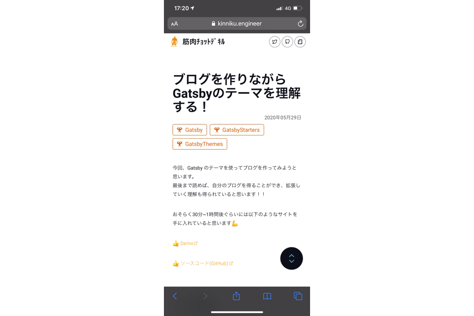
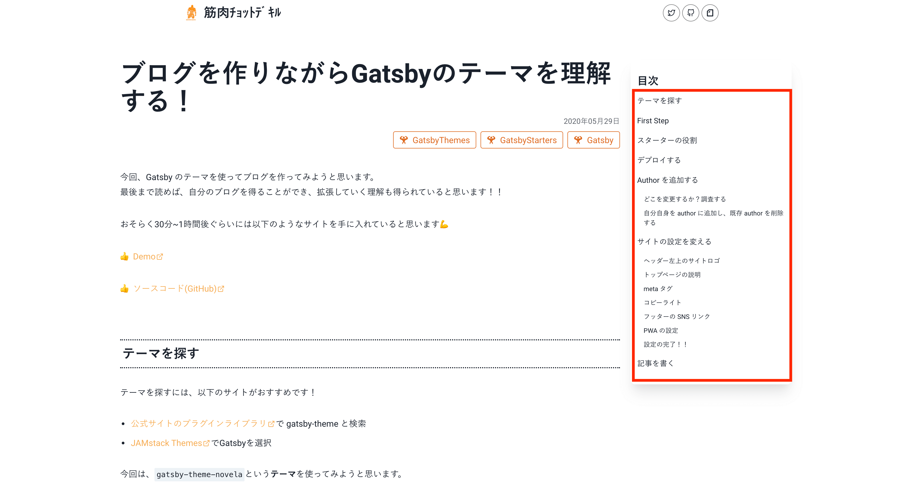

import ArrowDescription from '../../../src/components/widgetComponents/ArrowDescription';
import Collapse from '../../../src/components/widgetComponents/Collapse';
import ExternalLink from '../../../src/components/widgetComponents/ExternalLink';

Gatsby で作っている当ブログに、先日目次を追加したのでご紹介します！

## デモ

いま目次が表示されているかと思いますが、PC とスマホで表示が違うのでデモを御覧ください！

### PC

こんな感じに右のサイドバーに表示してます！


### スマホ

画面右下のボタンをタップすると目次が現れます！  
React の公式ドキュメント風！



## データ取得

目次に使う各タイトルのデータを取得するには以下のプラグインを使います。

<ArrowDescription>
  <>
    <ExternalLink href='https://github.com/gatsbyjs/gatsby/tree/master/packages/gatsby-transformer-remark'>
      gatsby-transformer-remark
    </ExternalLink>
    または
    <ExternalLink href='https://github.com/gatsbyjs/gatsby/tree/master/packages/gatsby-plugin-mdx'>
      gatsby-plugin-mdx
    </ExternalLink>
  </>
  <>titleとurlをもったheading情報をnodeに追加するため</>
</ArrowDescription>

<ArrowDescription>
  <>
    <ExternalLink href='https://github.com/gatsbyjs/gatsby/tree/master/packages/gatsby-remark-autolink-headers'>
      gatsby-remark-autolink-headers
    </ExternalLink>
  </>
  <>HTMLのheading elementにidを付与するため</>
</ArrowDescription>

### gatsby-transformer-remark または gatsby-plugin-mdx

すでに`.md`ファイルや`.mdx`ファイルを追加してページを作成しているなら入っているプラグインだと思います。

これらのプラグインが入っていることで、`tableOfContents`という node が追加されます。  
（これ以降の記事では、gatsby-transformer-remark ではなく gatsby-plugin-mdx を使っていることを想定して説明します。gatsby-transformer-remark を使っている方は適宜読み替えてください。）

ローカルで作業中の方は、<ExternalLink href='http://localhost:8000/__graphql'>http://localhost:8000/__graphql</ExternalLink>にアクセスし、GraphiQL で確認してみましょう。

```graphql title=クエリ
query {
  allMdx {
    edges {
      node {
        tableOfContents
      }
    }
  }
}
```

```json title=出力結果
{
  "data": {
    "allMdx": {
      "edges": [
        {
          "node": {
            "tableOfContents": {
              "items": [
                {
                  "url": "#機能紹介",
                  "title": "機能紹介",
                  "items": [
                    {
                      "url": "#シンタックスハイライト",
                      "title": "シンタックスハイライト"
                    },
                    {
                      "url": "#タイトル",
                      "title": "タイトル"
                    },
                    {
                      "url": "#コードのコピー",
                      "title": "コードのコピー"
                    },
                    {
                      "url": "#行のハイライト",
                      "title": "行のハイライト"
                    },
                    {
                      "url": "#ワードのハイライト",
                      "title": "ワードのハイライト"
                    },
                    {
                      "url": "#jsx-のデモ表示",
                      "title": "JSX のデモ表示"
                    },
                    {
                      "url": "#jsx-のライブエディター",
                      "title": "JSX のライブエディター"
                    }
                  ]
                },
                {
                  "url": "#コード",
                  "title": "コード"
                }
              ]
            }
          }
        },
        {
          "node": {
            "tableOfContents": {
              "items": [
                {
                  "url": "#テーマを探す",
                  "title": "テーマを探す"
                },
                {
                  "url": "#first-step",
                  "title": "First Step"
                },
                {
                  "url": "#スターターの役割",
                  "title": "スターターの役割"
                },
                {
                  "url": "#デプロイする",
                  "title": "デプロイする"
                },
                {
                  "url": "#author-を追加する",
                  "title": "Author を追加する",
                  "items": [
                    {
                      "url": "#どこを変更するか？調査する",
                      "title": "どこを変更するか？調査する"
                    },
                    {
                      "url": "#自分自身を-author-に追加し、既存-author-を削除する",
                      "title": "自分自身を author に追加し、既存 author を削除する"
                    }
                  ]
                },
                {
                  "url": "#サイトの設定を変える",
                  "title": "サイトの設定を変える",
                  "items": [
                    {
                      "url": "#ヘッダー左上のサイトロゴ",
                      "title": "ヘッダー左上のサイトロゴ"
                    },
                    {
                      "url": "#トップページの説明",
                      "title": "トップページの説明"
                    },
                    {
                      "url": "#meta-タグ",
                      "title": "meta タグ"
                    },
                    {
                      "url": "#コピーライト",
                      "title": "コピーライト"
                    },
                    {
                      "url": "#フッターの-sns-リンク",
                      "title": "フッターの SNS リンク"
                    },
                    {
                      "url": "#pwa-の設定",
                      "title": "PWA の設定"
                    },
                    {
                      "url": "#設定の完了！！",
                      "title": "設定の完了！！"
                    }
                  ]
                },
                {
                  "url": "#記事を書く",
                  "title": "記事を書く"
                }
              ]
            }
          }
        }
      ]
    }
  }
}
```

このように、heading 要素の url と title が node に追加されます。

のちほど、このデータを取得し表示するときに使います。

### gatsby-remark-autolink-headers

このプラグインは、タイトルのホバーリンクのために使われます。


heding 要素に id が付与されるので、  
タイトルそれぞれにアンカー付きのリンク（`~~#anchor`）が存在します。

よって、目次内のリンクをクリックすることで、各タイトルに飛ぶことができるようになりそうです！

## 目次を表示

目次を表示していきましょう！  
当ブログでの表示を説明しますので、参考に自分好みの目次を作成してください！

また、以下のライブラリを使用しています。  
（どれもUIに関わるものなので必須ではありません。お好きなものをどうぞ！）

- <ExternalLink href='https://chakra-ui.com/'>Chakra UI</ExternalLink>
- <ExternalLink href='https://react-icons.github.io/react-icons/'>
    React Icons
  </ExternalLink>
- <ExternalLink href='https://emotion.sh/'>Emotion</ExternalLink>
- <ExternalLink href='https://github.com/fisshy/react-scroll'>
    React Scroll
  </ExternalLink>

### テンプレートファイル

ブログ記事のテンプレートファイルである、`src/templates/blog-post/index.js`で`TOC`と`TOCDrawer`を import して表示しています。

```jsx title=src/templates/blog-post/index.js line={11,55-60,63-66,96}
import React from 'react';
import { graphql } from 'gatsby';
import { Box, Divider, Grid } from '@chakra-ui/core';

import Layout from '../../components/layout';
import SEO from '../../components/SEO';
import Bio from '../../components/Bio';
import ContentArticle from '../../components/ContentArticle';
import PrevNextArticles from '../../components/PrevNextArticles';
import SnsShare from '../../components/SnsShare';
import { TOC, TOCDrawer } from '../../components/TOC';

const BlogPostTemplate = ({ data, pageContext, location }) => {
  const { previous: prev, next } = pageContext;
  const mdx = data.mdx;
  const url = `${data.site.siteMetadata.siteUrl}${mdx.fields.slug}`;
  const title = mdx.frontmatter.title;
  const tocData = data.mdx.tableOfContents.items;

  return (
    <Layout location={location} position='relative'>
      <SEO
        title={title}
        description={mdx.frontmatter.description || mdx.excerpt}
        cover={mdx.frontmatter.cover?.publicURL}
        isArticle
      />
      <Grid
        mx='auto'
        px='6'
        py='16'
        maxW='containers.xl'
        gap='5'
        gridTemplateColumns={[
          '100%',
          '100%',
          'calc(100% - 200px) 200px',
          'calc(100% - 300px) 300px',
        ]}
        templateAreas={[
          '"article"',
          '"article"',
          '"article aside"',
          '"article aside"',
        ]}
      >
        <Box as='article' gridArea='article'>
          <ContentArticle post={mdx} />
          <SnsShare url={url} title={title} mt='4' />
          <Divider mt='2' />
          <Bio mt='6' />
          <PrevNextArticles prev={prev} next={next} mt='10' />
        </Box>
        <Box as='aside' gridArea='aside' position='relative'>
          <TOC
            headings={data.mdx.tableOfContents.items}
            position='sticky'
            top='0'
            d={['none', 'none', 'block', 'block']}
          />
        </Box>
      </Grid>
      <TOCDrawer
        headings={data.mdx.tableOfContents.items}
        d={['inline-block', 'inline-block', 'none', 'none']}
      />
    </Layout>
  );
};

export default BlogPostTemplate;

export const pageQuery = graphql`
  query BlogPostBySlug($slug: String!) {
    site {
      siteMetadata {
        siteUrl
      }
    }
    mdx(fields: { slug: { eq: $slug } }) {
      id
      excerpt(pruneLength: 160)
      body
      fields {
        slug
      }
      frontmatter {
        title
        date(formatString: "YYYY年MM月DD日")
        description
        tags
        cover {
          publicURL
        }
      }
      tableOfContents
    }
  }
`;
```

先述の`tableOfContents`の`items`を  
`TOC`コンポーネントと`TOCDrawer`コンポーネントに渡しています。

また、  
`TOC`コンポーネントは PC で表示、スマホでは非表示  
`d={['none', 'none', 'block', 'block']}`

`TOCDrawer`コンポーネントは PC で非表示、スマホでは表示  
`d={['inline-block', 'inline-block', 'none', 'none']}`

となっています。

レスポンシブについては、<ExternalLink href='https://chakra-ui.com/responsive-styles'>Chakra UI のドキュメント</ExternalLink>を参照

### TOC コンポーネント

このコンポーネントは目次の枠を用意しており、目次の中身は後述の`HeadingList`コンポーネントに委譲しています。

```jsx title=TOCコンポーネント
import React from 'react';
import { Box, Heading } from '@chakra-ui/core';

const TOC = ({ headings, ...props }) => (
  <Box
    p='3'
    boxShadow='0 20px 25px -5px rgba(0,0,0,0.1), 0 10px 10px -5px rgba(0,0,0,0.04)'
    borderRadius='lg'
    {...props}
  >
    <Heading as='h3' size='md' mt='4'>
      目次
    </Heading>
    <Box overflowY='auto' maxH='70vh'>
      <HeadingList headings={headings} />
    </Box>
  </Box>
);
```

### HeadingList コンポーネント

このコンポーネントは目次の中身（画像の赤枠内）であり、以下の特徴があります。

- heading のタイトルが表示されている
- 各タイトルをクリックで、同じタイトルにスムーススクロールする
- 各タイトルは階層になっており、たとえば h2 の中に h3 があればネストして表示される



```jsx title=HeadingListコンポーネント
import React from 'react';
import { List, ListItem } from '@chakra-ui/core';
import { Link } from 'react-scroll';
import { css } from '@emotion/core';

const HeadingList = ({ headings, itemMy = '4', onDrawerClose, ...props }) => (
  <List mt='3' fontSize='sm' {...props}>
    {headings.map(heading => (
      <React.Fragment key={heading.title}>
        <ListItem my={itemMy}>
          <Link
            to={heading.url.replace('#', '')}
            smooth={true}
            offset={-10}
            duration={800}
            onClick={onDrawerClose && onDrawerClose}
            css={css`
              cursor: pointer;
              &:hover,
              &.active {
                text-decoration: underline;
                opacity: 0.7;
              }
            `}
          >
            {heading.title}
          </Link>
        </ListItem>
        {heading.items && (
          <HeadingList
            headings={heading.items}
            itemMy='2'
            onDrawerClose={onDrawerClose}
            ml='3'
            mt='0'
            fontSize='xs'
          />
        )}
      </React.Fragment>
    ))}
  </List>
);
  <List mt='3' fontSize='sm' {...props}>
    {headings.map(heading => (
      <React.Fragment key={heading.title}>
        <ListItem my={itemMy}>
          <Link
            to={heading.url.replace('#', '')}
            smooth={true}
            offset={-10}
            duration={800}
            onClick={onDrawerClose && onDrawerClose}
            css={css`
              cursor: pointer;
              &:hover,
              &.active {
                text-decoration: underline;
                opacity: 0.7;
              }
            `}
          >
            {heading.title}
          </Link>
        </ListItem>
        {heading.items && (
          <HeadingList
            headings={heading.items}
            itemMy='2'
            onDrawerClose={onDrawerClose}
            ml='3'
            mt='0'
            fontSize='xs'
          />
        )}
      </React.Fragment>
    ))}
  </List>
);
```

`HeadingList`コンポーネント内で再帰的に`HeadingList`コンポーネントをレンダーしていることに注目してください。  
これは、`heading.items`が true 相当のとき。つまり、さらに深い heading 要素があるときに再帰的にレンダーします。

たとえば以下のデータのように h2 の中に h3 があるとき、

```json
{
  "data": {
    "allMdx": {
      "edges": [
        {
          "node": {
            "tableOfContents": {
              "items": [
                {
                  "url": "#h2タイトル",
                  "title": "h2タイトル",
                  "items": [
                    {
                      "url": "#h3タイトルA",
                      "title": "h3タイトルA"
                    },
                    {
                      "url": "#h3タイトルB",
                      "title": "h3タイトルB"
                    },
                },
              ]
            },
          }
        }
      ]
    }
  }
}
```

以下のようにul li をネストしたHTMLを生成します。

```html
<ul class="css-15tyfp5">
  <li class="css-1hcp4tm">
    <a class="css-1tym40f-HeadingList">h2タイトル</a>
  </li>
  <ul class="css-18pzcey">
    <li class="css-1hvje3t">
      <a class="css-1tym40f-HeadingList">h3タイトルA</a>
    </li>
    <li class="css-1hvje3t">
      <a class="css-1tym40f-HeadingList">h3タイトルB</a>
    </li>
  </ul>
  </ul>
</ul>
```

### TOCDrawerコンポーネント

このコンポーネントは、スマホで右下のボタンをクリックすると目次を表示します。

```jsx title=TOCDrawerコンポーネント
import React from 'react';
import {
  useDisclosure,
  Box,
  Drawer,
  DrawerBody,
  DrawerHeader,
  DrawerOverlay,
  DrawerContent,
  DrawerCloseButton,
  Flex,
  Icon,
} from '@chakra-ui/core';
import { FiChevronUp, FiChevronDown } from 'react-icons/fi';

const TOCDrawer = ({ headings, ...props }) => {
  const { isOpen, onClose, onToggle } = useDisclosure();
  const btnRef = React.useRef();
  const iconStyles = {
    size: '6',
    transition: '0.2s ease 0s, transform 0.2s ease 0s',
  };
  return (
    <>
      <Box
        ref={btnRef}
        position='fixed'
        bottom='12'
        right='5'
        color='blue.300'
        bg='gray.800'
        borderRadius='50%'
        shadow='0 0 20px rgba(0, 0, 0, 0.3)'
        zIndex='1401'
        onClick={onToggle}
        {...props}
      >
        <Flex align='flex-start' overflow='hidden' h='64px'>
          <Flex direction='column' alignSelf='center' px='5'>
            <Icon
              as={FiChevronUp}
              transform={`translateY(${isOpen ? 15 : 4}px)`}
              {...iconStyles}
            />
            <Icon
              as={FiChevronDown}
              transform={`translateY(-${isOpen ? 15 : 4}px)`}
              {...iconStyles}
            />
          </Flex>
        </Flex>
      </Box>
      <Drawer
        isOpen={isOpen}
        placement='right'
        size='md'
        onClose={onClose}
        finalFocusRef={btnRef}
      >
        <DrawerOverlay />
        <DrawerContent>
          <DrawerCloseButton />
          <DrawerHeader>目次</DrawerHeader>
          <DrawerBody pb='24' overflowY='auto'>
            <HeadingList headings={headings} onDrawerClose={onClose} />
          </DrawerBody>
        </DrawerContent>
      </Drawer>
    </>
  );
};
```

`HeadingList`コンポーネントにDrawerを閉じる関数を渡しています。  
これはリンクの`onClick`に使われており、`HeadingList`はpropsで`onDrawerClose`を受け取っているとリンククリック時にDrawerを閉じます。

<Collapse>
<>コードを確認する</>

```jsx title=HeadingListコンポーネント line={6}
<Link
  to={heading.url.replace('#', '')}
  smooth={true}
  offset={-10}
  duration={800}
  onClick={onDrawerClose && onDrawerClose}
  css={css`
    cursor: pointer;
    &:hover,
    &.active {
      text-decoration: underline;
      opacity: 0.7;
    }
  `}
>
  {heading.title}
</Link>
```
</Collapse>

Chakra UIのDrawerコンポーネントを使用しています。  
Drawerの動作の確認は簡素化したデモでご確認ください！

```jsx live title=Drawerデモ
function DrawerExample() {
  const { isOpen, onOpen, onClose } = useDisclosure();
  const btnRef = React.useRef();

  return (
    <>
      <Button ref={btnRef} variantColor="teal" onClick={onOpen}>
        Open
      </Button>
      <Drawer
        isOpen={isOpen}
        placement="right"
        onClose={onClose}
        finalFocusRef={btnRef}
      >
        <DrawerOverlay />
        <DrawerContent>
          <DrawerCloseButton />
          <DrawerHeader>Create your account</DrawerHeader>

          <DrawerBody>
            <Input placeholder="Type here..." />
          </DrawerBody>

          <DrawerFooter>
            <Button variant="outline" mr={3} onClick={onClose}>
              Cancel
            </Button>
            <Button color="blue">Save</Button>
          </DrawerFooter>
        </DrawerContent>
      </Drawer>
    </>
  );
}
```

## おわり

以上で目次の実装紹介はおわりです！

実際のコードのリンクも貼っておくのでぜひご活用ください！

- <ExternalLink href='https://github.com/YuukiOkamoto/my-blog/blob/master/src/templates/blog-post/index.js'>https://github.com/YuukiOkamoto/my-blog/blob/master/src/templates/blog-post/index.js</ExternalLink>
- <ExternalLink href='https://github.com/YuukiOkamoto/my-blog/blob/master/src/components/TOC.js'>https://github.com/YuukiOkamoto/my-blog/blob/master/src/components/TOC.js</ExternalLink>