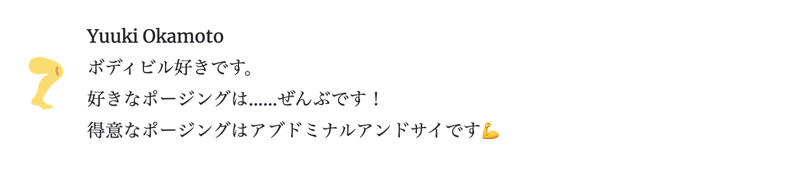

import Callout from '../../../src/components/widgetComponents/Callout';
import Collapse from '../../../src/components/widgetComponents/Collapse';
import ExternalLink from '../../../src/components/widgetComponents/ExternalLink';
import PostLink from '../../../src/components/widgetComponents/PostLink';

Gatsby サイトにテーマを使って機能を追加することはよくあります。  
ただテーマはスターターとは違い、実装のコードはアプリ内にはなく npm でインストールします。

それではどのようにカスタマイズするのでしょうか？

テーマをカスタマイズする最も簡単な方法は、  
テーマが提供しているオプションを指定することです。

たとえば`gatsby-theme-blog`というテーマでは、以下のようなオプションを指定できます。

| Key                      | Default value    | Description                                                                          |
| ------------------------ | ---------------- | ------------------------------------------------------------------------------------ |
| `basePath`               | `/`              | ブログ記事のルート URL を指定できる                                                  |
| `contentPath`            | `content/posts`  | ブログ記事ファイルを置くパスを指定                                                   |
| `assetPath`              | `content/assets` | アセットファイルを置くパスを指定                                                     |
| `mdxOtherwiseConfigured` | `false`          | 既に`gatsby-plugin-mdx`がサイトで導入されていれば、`true`を指定する                  |
| `disableThemeUiStyling`  | `false`          | `gatsby-plugin-theme-ui`スタイルなしでブログテーマを使用したい場合、`true`を指定する |
| `excerptLength`          | `140`            | 自動生成されるブログ記事の冒頭抜粋の長さ                                             |
| `webfontURL`             | `''`             | 含めたい Web フォントの URL                                                          |

ただ、このようにオプションが提供してくれていないものをカスタマイズしたいことがよくあります。
そんなときは「シャドウイング」という方法を使います。

この記事ではシャドウイングについてご紹介します。

また、こちらの記事の続きです。

<PostLink to='/blog/what-is-gatsby-themes/' />

## やりたいこと

### Before

今回は BIO を変更したいと思います。

まずは前回の最後の状態。before を御覧ください。


名前が自分の名前ではないので自分の名前に変えたいのと、  
かんたんな自己紹介もいれたいですね。

以下から実際のサイトとソースコードも確認できます。

<ExternalLink href='https://example-of-gatsby-theme-usage.netlify.app/'>
  Demo
</ExternalLink>
<ExternalLink href='https://github.com/YuukiOkamoto/example-of-gatsby-theme-usage/tree/master'>
  ソースコード
</ExternalLink>

### After

名前の変更とかんたんな自己紹介を表示します。



以下から実際のサイトとソースコードも確認できます。

<ExternalLink href='https://example-of-gatsby-theme-shadowing.netlify.app/'>
  Demo
</ExternalLink>
<ExternalLink href='https://github.com/YuukiOkamoto/example-of-gatsby-theme-shadowing/tree/master'>
  ソースコード
</ExternalLink>

## シャドウイング

シャドウイングは、テーマの src ディレクトリ内のコンポーネント、オブジェクト、その他のものを
オーバーライドしてカスタマイズできる機能です。

## 実・装！！

今回、`gatsby-theme-blog`というテーマの 2 つのコンポーネントをシャドウイングします。

<ExternalLink href='https://github.com/gatsbyjs/gatsby/blob/master/packages/gatsby-theme-blog/src/components/bio.js'>
  Bioコンポーネント
</ExternalLink>
と<ExternalLink href='https://github.com/gatsbyjs/gatsby/blob/master/packages/gatsby-theme-blog/src/components/bio-content.js'>
  BioContentコンポーネント
</ExternalLink>
です。

シャドウイングするために、ファイルパスを把握します。

```text title=テーマ側のコンポーネントのパス
gatsby-theme-blog
└── src
    └── components
        ├── bio.js
        └── bio-content.js
```

これをシャドウイングするためには、自サイトに以下のパスで同名のファイルを作成します。

```text title=自サイトのコンポーネントのパス
src
└── gatsby-theme-blog
    └── components
        ├── bio.js
        └── bio-content.js
```

### BioContent コンポーネントのシャドウイング

レンダリングする内容を、自分の名前とかんたんな自己紹介に変えます。

```jsx
<>
  {author}
  <br />
  ボディビル好きです。
  <br />
  好きなポージングは……ぜんぶです！
  <br />
  得意なポージングはアブドミナルアンドサイです💪
</>
```

<Collapse>
<>テーマのbio-content.js全文</>

```jsx title=gatsby-theme-blog/src/components/bio-content.js
import React, { Fragment } from 'react';
import { Styled } from 'theme-ui';

/**
 * Shadow me to add your own bio content
 */

export default () => (
  <Fragment>
    Words by <Styled.a href='http://example.com/'>Jane Doe</Styled.a>.
    <br />
    Change me. This is all quite default.
  </Fragment>
);
```

</Collapse>

<Collapse>
<>自サイトのbio-content.js全文</>

```jsx title=src/gatsby-theme-blog/components/bio-content.js
import React from 'react';

export default ({ author }) => (
  <>
    {author}
    <br />
    ボディビル好きです。
    <br />
    好きなポージングは……ぜんぶです！
    <br />
    得意なポージングはアブドミナルアンドサイです💪
  </>
);
```

</Collapse>

### Bio コンポーネントのシャドウイング

BioContent コンポーネントで、`gatsby-config.js`で設定した sitemetadat の`author`を使いたいので、  
以下のように`author`を渡すよう変更します。

```diff
- <BioContent />
+ <BioContent author={author} />
```

<Collapse>
<>テーマのbio.js全文</>

```jsx title=gatsby-theme-blog/src/components/bio.js
/**
 * Bio component that queries for data
 * with Gatsby's StaticQuery component
 *
 * See: https://www.gatsbyjs.org/docs/static-query/
 */

import React from 'react';
import { useStaticQuery, graphql } from 'gatsby';
import Image from 'gatsby-image';
import { Styled, css, Flex } from 'theme-ui';
import BioContent from './bio-content';

const Bio = () => {
  const data = useStaticQuery(bioQuery);
  const {
    site: {
      siteMetadata: { author },
    },
    avatar,
  } = data;

  return (
    <Flex css={css({ mb: 4, alignItems: `center` })}>
      {avatar ? (
        <Image
          fixed={avatar.childImageSharp.fixed}
          alt={author}
          css={css({
            mr: 2,
            mb: 0,
            width: 48,
            minWidth: 48,
            borderRadius: 99999,
          })}
        />
      ) : (
        <div
          css={css({
            mr: 2,
            mb: 0,
            width: 48,
            minWidth: 48,
            borderRadius: 99999,
          })}
          role='presentation'
        />
      )}
      <Styled.div>
        <BioContent />
      </Styled.div>
    </Flex>
  );
};

const bioQuery = graphql`
  query BioQuery {
    site {
      siteMetadata {
        author
      }
    }
    avatar: file(absolutePath: { regex: "/avatar.(jpeg|jpg|gif|png)/" }) {
      childImageSharp {
        fixed(width: 48, height: 48) {
          ...GatsbyImageSharpFixed
        }
      }
    }
  }
`;

export default Bio;
```

</Collapse>


<Collapse>
<>自サイトのbio.js全文</>

```jsx title=src/gatsby-theme-blog/components/bio.js
import React from 'react';
import { useStaticQuery, graphql } from 'gatsby';
import Image from 'gatsby-image';
import { Styled, css, Flex } from 'theme-ui';
import BioContent from './bio-content';

const Bio = () => {
  const data = useStaticQuery(bioQuery);
  const {
    site: {
      siteMetadata: { author },
    },
    avatar,
  } = data;

  return (
    <Flex css={css({ mb: 4, alignItems: `center` })}>
      {avatar ? (
        <Image
          fixed={avatar.childImageSharp.fixed}
          alt={author}
          css={css({
            mr: 2,
            mb: 0,
            width: 48,
            minWidth: 48,
            borderRadius: 99999,
          })}
        />
      ) : (
        <div
          css={css({
            mr: 2,
            mb: 0,
            width: 48,
            minWidth: 48,
            borderRadius: 99999,
          })}
          role='presentation'
        />
      )}
      <Styled.div>
        <BioContent author={author} />
      </Styled.div>
    </Flex>
  );
};

const bioQuery = graphql`
  query {
    site {
      siteMetadata {
        author
      }
    }
    avatar: file(absolutePath: { regex: "/avatar.(jpeg|jpg|gif|png)/" }) {
      childImageSharp {
        fixed(width: 48, height: 48) {
          ...GatsbyImageSharpFixed
        }
      }
    }
  }
`;

export default Bio;
```

</Collapse>

<Callout emoji='🙌🙌' bg='orange.100'>
  このように、オーバーライドしたいファイルを用意するだけなのでテーマは便利ですね！
</Callout>
