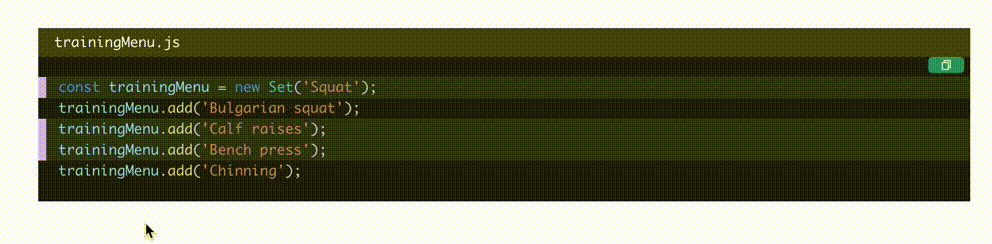
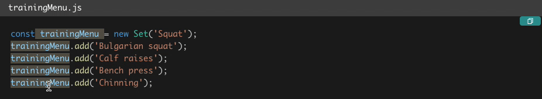
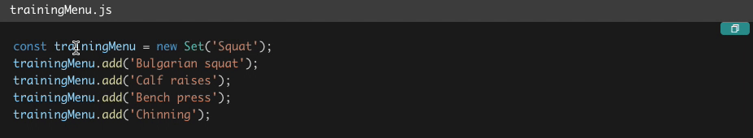

import Callout from '../../../src/components/widgetComponents/Callout';
import ExternalLink from '../../../src/components/widgetComponents/ExternalLink';

## つくったもの

hover したらコードブロック内の同じ単語がハイライトされます！



ブログのサンプルコードなんかを読んでて、

<Callout emoji='🤔' bg='orange.50'>
  あれ？この変数ってどこで定義されてるんだ？
</Callout>

ってことがよくあるけど、ハイライトされるとコードが置いやすくなって便利かなと思って作りました！  
Qiita からヒントを得て！（パクリ w）

## 実装

### シンタックスハイライト

まず、シンタックスハイライトをするために当ブログでは<ExternalLink href='https://github.com/FormidableLabs/prism-react-renderer'>prism-react-renderer</ExternalLink>というライブラリを使っています。

prism-react-renderer の詳細は割愛しますが、  
`Highlight`コンポーネントの`code`という state に表示するコード文字列を渡し、`tokens`という配列を操作しています。二次元の配列となっており、各行の中に各単語が入っています。  
各単語それぞれに色付けをする必要があるので、各単語を`<span>`タグで囲って style を適用しています。

```jsx title=prism-react-rendererのサンプルコード
import React from 'react';
import Highlight, { defaultProps } from 'prism-react-renderer';

const exampleCode = `
(function someDemo() {
  var test = "Hello World!";
  console.log(test);
})();

return () => <App />;
`.trim();

export default () => (
  <Highlight {...defaultProps} code={exampleCode} language='jsx'>
    {({ className, style, tokens, getLineProps, getTokenProps }) => (
      <pre className={className} style={style}>
        {tokens.map((line, i) => (
          <div {...getLineProps({ line, key: i })}>
            {line.map((token, key) => (
              <span {...getTokenProps({ token, key })} />
            ))}
          </div>
        ))}
      </pre>
    )}
  </Highlight>
);
```

### ホバーした文字列を state で管理する

`token.content`で単語の文字列を取得できるので、空白を除去して state 管理します。

```jsx line={1,14,24-25}
import React, { useState } from 'react';
import Highlight, { defaultProps } from 'prism-react-renderer';

const exampleCode = `
(function someDemo() {
  var test = "Hello World!";
  console.log(test);
})();

return () => <App />;
`.trim();

export default () => {
  const [focusedWord, setFocusedWord] = useState('');

  return (
    <Highlight {...defaultProps} code={exampleCode} language='jsx'>
      {({ className, style, tokens, getLineProps, getTokenProps }) => (
        <pre className={className} style={style}>
          {tokens.map((line, i) => (
            <div {...getLineProps({ line, key: i })}>
              {line.map((token, key) => (
                <span
                  onMouseEnter={() => setFocusedWord(token.content.trim())}
                  onMouseLeave={() => setFocusedWord('')}
                  {...getTokenProps({ token, key })}
                />
              ))}
            </div>
          ))}
        </pre>
      )}
    </Highlight>
  );
};
```

### ホバーした文字と同じ文字の背景に色を付ける

stateの`focusedWord`と同じ文字であり、1文字より大きいものの背景に色をつけます。  
また、CSSと同じような記述ができることから、このサンプルコードでは<ExternalLink href='https://emotion.sh/docs/css-prop'>emotion</ExternalLink>というCSS-in-JSのライブラリのcss propを使っています。

```jsx line={1,4,18,30-32}
/** @jsx jsx */
import React, { useState } from "react";
import Highlight, { defaultProps } from "prism-react-renderer";
import { css, jsx } from "@emotion/core";

const exampleCode = `
(function someDemo() {
  var test = "Hello World!";
  console.log(test);
})();

return () => <App />;
`.trim();

export default () => {
  const [focusedWord, setFocusedWord] = useState("");

  const shouldHighlighted = word => focusedWord === word && word.length > 1;

  return (
    <Highlight {...defaultProps} code={exampleCode} language="jsx">
      {({ className, style, tokens, getLineProps, getTokenProps }) => (
        <pre className={className} style={style}>
          {tokens.map((line, i) => (
            <div {...getLineProps({ line, key: i })}>
              {line.map((token, key) => (
                <span
                  onMouseEnter={() => setFocusedWord(token.content.trim())}
                  onMouseLeave={() => setFocusedWord("")}
                  css={shouldHighlighted(token.content.trim()) && css`
                    background-color: rgba(254,235,200,0.24);
                  `}
                  {...getTokenProps({ token, key })}
                />
              ))}
            </div>
          ))}
        </pre>
      )}
    </Highlight>
  );
};
```

### Wordコンポーネントに分ける

少しコードが増えてきたので1単語をレンダリングするコンポーネントを作りたいと思います！

```jsx line={15-31,43-49}
/** @jsx jsx */
import React, { useState } from "react";
import Highlight, { defaultProps } from "prism-react-renderer";
import { css, jsx } from "@emotion/core";

const exampleCode = `
(function someDemo() {
  var test = "Hello World!";
  console.log(test);
})();

return () => <App />;
`.trim();

const Word = ({ focusedWord, setFocusedWord, content, tokenProps }) => {
  const shouldHighlighted = word => focusedWord === word && word.length > 1;

  return (
    <span
      onMouseEnter={() => setFocusedWord(content)}
      onMouseLeave={() => setFocusedWord("")}
      css={
        shouldHighlighted(content) &&
        css`
          background-color: rgba(254, 235, 200, 0.24);
        `
      }
      {...tokenProps}
    />
  );
};

export default () => {
  const [focusedWord, setFocusedWord] = useState("");

  return (
    <Highlight {...defaultProps} code={exampleCode} language="jsx">
      {({ className, style, tokens, getLineProps, getTokenProps }) => (
        <pre className={className} style={style}>
          {tokens.map((line, i) => (
            <div {...getLineProps({ line, key: i })}>
              {line.map((token, key) => (
                <Word
                  key={key}
                  focusedWord={focusedWord}
                  setFocusedWord={setFocusedWord}
                  content={token.content.trim()}
                  tokenProps={getTokenProps({ token, key })}
                />
              ))}
            </div>
          ))}
        </pre>
      )}
    </Highlight>
  );
};
```


### 時間差で背景色をつける

ホバーしてすぐ背景色がついてしまうと、たまたまマウスが文字の上を通っただけでも目まぐるしく色が変わってしまいます。



そこで一定時間ホバーしたときに背景色が変わるようにしたいと思います。

```jsx line={18-24,26-29,35-36}
/** @jsx jsx */
import React, { useState } from "react";
import Highlight, { defaultProps } from "prism-react-renderer";
import { css, jsx } from "@emotion/core";

const exampleCode = `
(function someDemo() {
  var test = "Hello World!";
  console.log(test);
})();

return () => <App />;
`.trim();

const Word = ({ focusedWord, setFocusedWord, content, tokenProps }) => {
  const [delayHandler, setDelayHandler] = useState(null);

  const handleMouseEnter = word => {
    setDelayHandler(
      setTimeout(() => {
        setFocusedWord(word);
      }, 500)
    );
  };

  const handleMouseLeave = () => {
    setFocusedWord("");
    clearTimeout(delayHandler);
  };

  const shouldHighlighted = word => focusedWord === word && word.length > 1;

  return (
    <span
      onMouseEnter={() => handleMouseEnter(content)}
      onMouseLeave={handleMouseLeave}
      css={
        shouldHighlighted(content) &&
        css`
          background-color: rgba(254, 235, 200, 0.24);
        `
      }
      {...tokenProps}
    />
  );
};

export default () => {
  const [focusedWord, setFocusedWord] = useState("");

  return (
    <Highlight {...defaultProps} code={exampleCode} language="jsx">
      {({ className, style, tokens, getLineProps, getTokenProps }) => (
        <pre className={className} style={style}>
          {tokens.map((line, i) => (
            <div {...getLineProps({ line, key: i })}>
              {line.map((token, key) => (
                <Word
                  key={key}
                  focusedWord={focusedWord}
                  setFocusedWord={setFocusedWord}
                  content={token.content.trim()}
                  tokenProps={getTokenProps({ token, key })}
                />
              ))}
            </div>
          ))}
        </pre>
      )}
    </Highlight>
  );
};
```

これで無事、0.5秒ホバーし続けたときだけ背景色が変わるように出来ました！



<Callout bg='pink.50' emoji='🎉'>難しくない実装ですが利便性が上がったのでステキ！</Callout>