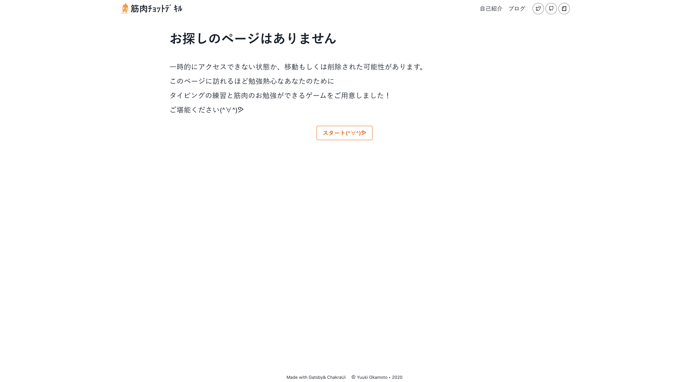
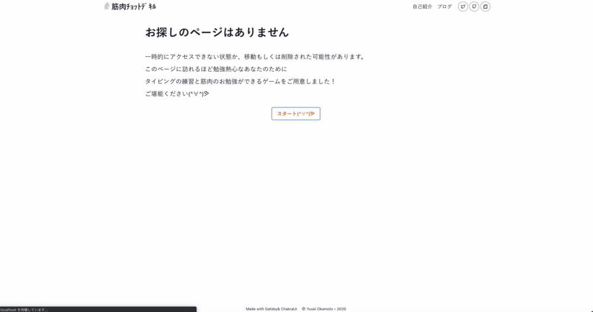

import ArrowDescription from '../../../src/components/widgetComponents/ArrowDescription';
import Collapse from '../../../src/components/widgetComponents/Collapse';
import Link from '../../../src/components/widgetComponents/Link';

## 404 ページをカスタマイズする

404 ページがデフォルトのままで寂しかったからカスタマイズしました！

作った 404 ページ



Gatsby では、`src/pages/404.js`を編集することで 404 時のページをカスタマイズすることが出来ます。

## おあそび

ただ 404 を表示するだけではおもしろくないかなぁ。  
404 ページに来るほど勉強熱心な方にはもっと筋肉を知ってもらいたいなぁ。

という思いから！  
404 ページにはタイピングゲームをご用意しました！



<Link href='/machomachomachomacho'>実際の404ページ</Link>

実装は以下のコードをご確認ください！

<ArrowDescription>
<>index.js</>

<>
  スタートボタンとタイピングゲームのコンポーネントをレンダリングしている。<br />
  スタートボタンをクリックするとタイピングゲームを表示。
  <Collapse>
  <>コードを見る</>

```jsx title=src/pages/404.js
import React, { useEffect, useRef } from 'react';
import { useDisclosure, Box, Button, Heading, Text } from '@chakra-ui/core';

import Layout from '../components/layout';
import SEO from '../components/SEO';
import Container from '../components/Container';
import TypingGame from '../components/TypingGame';

const NotFoundPage = ({ location }) => {
  const { isOpen, onOpen } = useDisclosure();
  const btnRef = useRef(null);

  useEffect(() => {
    const node = btnRef.current;
    if (node) {
      node.focus();
    }
  }, []);

  return (
    <Layout location={location}>
      <SEO title='404: Not Found' />
      <Container>
        <Heading as='h1' my='10'>
          お探しのページはありません
        </Heading>
        <Text my='6' fontSize='xl' lineHeight='2'>
          一時的にアクセスできない状態か、移動もしくは削除された可能性があります。
          <br />
          このページに訪れるほど勉強熱心なあなたのために
          <br />
          タイピングの練習と筋肉のお勉強ができるゲームをご用意しました！
          <br />
          ご堪能ください(^∀^)ᕗ
        </Text>
        <Box textAlign='center'>
          <Button
            ref={btnRef}
            d={isOpen && 'none'}
            variantColor='orange'
            variant='outline'
            onClick={onOpen}
          >
            スタート(^∀^)ᕗ
          </Button>
        </Box>
        <TypingGame mt='16' isOpen={isOpen} />
      </Container>
    </Layout>
  );
};

export default NotFoundPage;
```

  </Collapse>
</>
</ArrowDescription>

<ArrowDescription>
<>TypingGameコンポーネント</>

<>
  ここでタイピングする筋肉の名称や入力するコンポーネント、成功時のメッセージをレンダリングしている。<br/>
  筋肉の名称や成功時のメッセージをstateにもっている。
  <Collapse>
  <>コードを見る</>

```jsx title=src/components/TypingGame/index.js
import React, { useState, useEffect, useRef } from 'react';
import { Box, Text } from '@chakra-ui/core';

import clearedMessageList from './clearedMessageList';
import muscleList from './muscleList';
import Input from './Input';

const choose_at_random = arrayData => {
  const arrayIndex = Math.floor(Math.random() * arrayData.length);
  return arrayData[arrayIndex];
};

const TypingGame = ({ isOpen, ...props }) => {
  const [message, setMessage] = useState('');
  const [muscle, setMuscle] = useState(choose_at_random(muscleList));
  const inputRef = useRef(null);

  const setAllCorrectedMessage = () => {
    setMessage(`${choose_at_random(clearedMessageList)}(^∀^)ᕗ`);
    setTimeout(() => setMessage(''), 700);
  };

  const shuffleMuscle = () => {
    setMuscle(choose_at_random(muscleList));
  };

  useEffect(() => {
    const node = inputRef.current;
    if (node) {
      node.focus();
    }
  }, [isOpen]);

  return (
    <Box d={isOpen ? 'block' : 'none'} {...props}>
      {message === '' ? (
        <>
          <Box fontSize='2xl' textAlign='center'>
            {muscle.name}
          </Box>
          <Input
            inputRef={inputRef}
            muscle={muscle}
            setAllCorrectedMessage={setAllCorrectedMessage}
            shuffleMuscle={shuffleMuscle}
          />
        </>
      ) : (
        <Text textAlign='center' fontSize='lg'>
          {message}
        </Text>
      )}
    </Box>
  );
};

export default TypingGame;
```

  </Collapse>
</>
</ArrowDescription>

<ArrowDescription>
<>Inputコンポーネント</>

<>
  入力フィールドを表示するコンポーネント。<br/>
  入力状況に応じて、成功や失敗を判断している。
  <Collapse>
    <>コードを見る</>

```jsx title=src/components/TypingGame/Input.js
import React, { useState, useEffect } from 'react';
import { Box, Stack, Input as ChakraInput } from '@chakra-ui/core';

const Input = ({ inputRef, muscle, setAllCorrectedMessage, shuffleMuscle }) => {
  const [isInvalid, setIsInvalid] = useState(false);
  const [answerCharCount, setAnswerCharCount] = useState(0);

  useEffect(() => {
    const node = inputRef.current;
    if (node) {
      node.focus();
    }
  }, [inputRef]);

  const handleChange = event => {
    const answerChar = event.target.value;
    const muscleChar = muscle.alphabet[answerCharCount];
    const isCorrect = answerChar === muscleChar;
    if (isCorrect) {
      const isAllCorrect = muscle.alphabet[answerCharCount + 1] === undefined;
      if (isAllCorrect) {
        setAllCorrectedMessage();
        setAnswerCharCount(0);
        shuffleMuscle();
      } else setAnswerCharCount(answerCharCount + 1);
    }
    setIsInvalid(!isCorrect);
    event.target.value = '';
  };

  return (
    <Box position='relative'>
      <Stack isInline spacing='3' justify='center'>
        {muscle.alphabet.map((letter, i) => (
          <Box
            key={i}
            as='span'
            color={i < answerCharCount ? 'gray.300' : 'black'}
          >
            {letter}
          </Box>
        ))}
      </Stack>
      <ChakraInput
        ref={inputRef}
        position='absolute'
        top='0'
        variant='flushed'
        size='sm'
        isInvalid={isInvalid}
        css={{
          caretColor: 'transparent',
        }}
        onChange={handleChange}
      />
    </Box>
  );
};

export default Input;
```

  </Collapse>
</>
</ArrowDescription>
