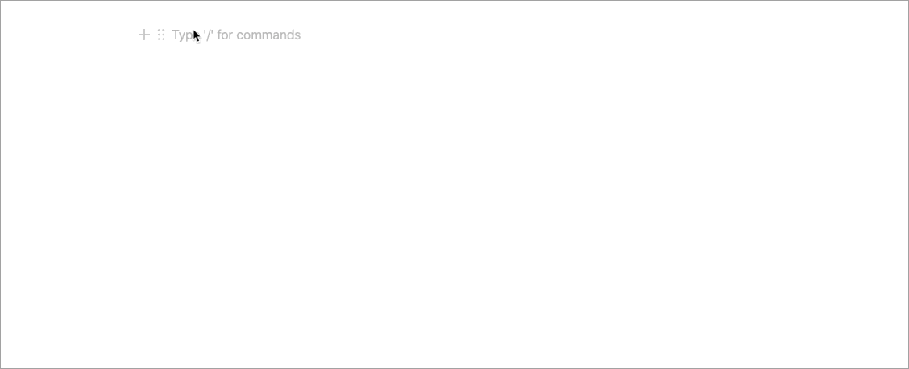

import { Alert, Stack } from '@chakra-ui/core';

import ExternalLink from '../../../src/components/widgetComponents/ExternalLink';
import Callout from '../../../src/components/widgetComponents/Callout';

MDX の紹介と、当ブログで使っているコンポーネントを紹介していきます 💪

## MDX について

基本的に当ブログの記事は Markdown 形式で書いているのですが、拡張子は`.md`ではなく`.mdx`です。  
Markdown の中に JSX を書くことが出来る。コンポーネントをインポートして使うことが出来る、MDX というものを使っています！

<ExternalLink href='https://mdxjs.com/'>公式サイト</ExternalLink>

## MDX のちからをお見せしましょう

### 外部リンク

実はもうこの記事でひとつ使っています！  
リンクをコンポーネントにして使っています！

```jsx render
<ExternalLink href='https://mdxjs.com/'>公式サイト</ExternalLink>
```

実際の記述はこちら。  
このように、Markdown 形式で書いている途中に Link コンポーネントを使うだけです。

```md title=mdx
import ExternalLink from '../../../src/components/widgetComponents/ExternalLink';

MDX の紹介と、当ブログで使っているコンポーネントを紹介していきます 💪

## MDX について

基本的に当ブログの記事は Markdown 形式で書いているのですが、拡張子は`.md`ではなく`.mdx`です。  
Markdown の中に JSX を書くことが出来る。コンポーネントをインポートして使うことが出来る、MDX というものを使っています！

<ExternalLink href='https://mdxjs.com/'>公式サイト</ExternalLink>
```

実際の Link コンポーネントはこちら。  
color はデフォでオレンジ(<span style="background-color: #F6AD55">#F6AD55</span>)となり、  
アイコンがついて別タブで開くようになってます。

```jsx title=Link.jsx
import React from 'react';
import { Icon, Link } from '@chakra-ui/core';
import { FiExternalLink } from 'react-icons/fi';

const ExternalLink = ({ color = 'orange.300', children, ...props }) => (
  <Link color={color} {...props}>
    {children}
    <Icon as={FiExternalLink} pb='.15em' />
  </Link>
);

export default ExternalLink;
```

<Callout emoji='🙌' my='5'>
  よく使うからコンポーネントにしてると楽ですね！！
</Callout>

### Callout

お次は直前に使ったこちら！

```jsx render
<Callout emoji='🙌'>よく使うからコンポーネントにしてると楽ですね！！</Callout>
```

Notion の Callout ↓ と似たものがほしかったのでコンポーネントにしました！



背景の小さいものも作れるし

```jsx render
<Callout emoji='🕺' p='1'>
  いぇいいぇい
</Callout>
```

背景の色だってかんたんに変えられちゃう

```jsx render
<Callout emoji='ᕕ( ᐛ )ᕗ' bg='pink.300'>
  わーーい
  <br />
  わーーーい
  <br />
  わーーーーい
</Callout>
```

コンポーネントにしておくと便利っすね！！

## Alert

自作のコンポーネントでなくても、コンポーネントライブラリも使えちゃいます！

例えば当サイトで使っている、<ExternalLink href='https://chakra-ui.com/'>Chakra UI</ExternalLink> のコンポーネントの例です！

こんな感じのAlertだって、簡単に書けちゃう！！

```jsx render title=Alertコンポーネントの例
<Stack spacing='3'>
  <Alert status='success'>
    <AlertIcon />
    犯罪係数アンダー60。<br/>執行対象ではありません。<br/>トリガーをロックします。
  </Alert>

  <Alert status='info'>
    <AlertIcon />
    犯罪係数オーバー130。<br/>執行モード：ノンリーサル・パラライザー。<br/>慎重に照準を定め 対象を制圧して下さい。
  </Alert>

  <Alert status='warning'>
    <AlertIcon />
    犯罪係数オーバー390。<br/>執行モード：リーサル・エリミネーター。<br/>慎重に照準を定め、対象を排除してください。
  </Alert>

  <Alert status='error'>
    <AlertIcon />
    対象の驚異判定が更新されました。<br/>執行モード：デストロイ・デコンポーザー。<br/>対象を完全排除します。ご注意下さい。
  </Alert>
</Stack>
```

<Callout emoji='🥰' my='5'>自由度が上がるから、楽しく書けちゃう！ちょっぴりReactのお勉強にもなるかも！！</Callout>